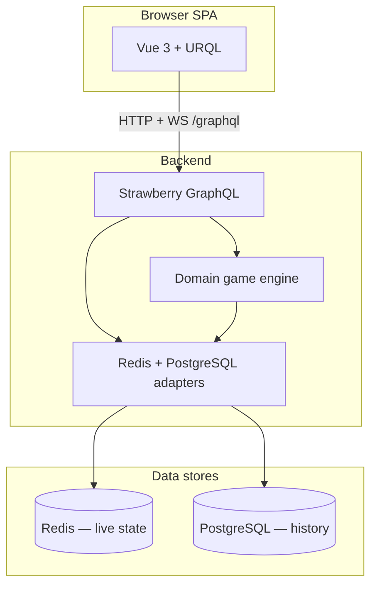

# Architecture Overview

## System Boundaries



| Layer | Location | Responsibility |
|---|---|---|
| Frontend | `frontend/src/` | Lobby, game UI, guest session persistence, GraphQL client |
| GraphQL API | `backend/app/graphql/` *(M3 — not started)* | Schema, resolvers, subscriptions, DataLoaders |
| Domain | `backend/app/domain/` *(M1 — complete)* | Pure 6 Nimmt rules — no I/O |
| Infrastructure | `backend/app/infrastructure/` *(M2 — complete)* | Redis sessions/rooms/game loop, pub/sub, timers, guest auth |
| Config / entry | `backend/app/config.py`, `main.py` | Settings, CORS, FastAPI lifespan, health GraphQL only |

## Current Implementation Status

**Last reviewed:** 2026-05-23

| Layer | Status | Notes |
|---|---|---|
| Domain (M1) | ✅ Complete | Pure rules + unit tests in `backend/app/domain/` |
| Infrastructure (M2) | ✅ Complete | Redis orchestration + 67 integration tests; not yet exposed via API |
| GraphQL API (M3) | ⬜ Stub | Only `health` query in `main.py`; no `backend/app/graphql/` |
| Frontend (M4) | 🟡 Scaffold | URQL client + read-only `guest-session.ts`; placeholder `App.vue` |
| PostgreSQL | ⬜ Declared only | `DATABASE_URL` in config; no models, migrations, or runtime usage |
| Playable MVP (M5) | ⬜ Blocked | Requires M3 + M4 |

**Runnable today:**

- **Backend:** FastAPI + Strawberry at `/graphql` with `health` only; Redis lifespan + pub/sub listener wired in `main.py`.
- **Frontend:** Vue 3 + Vite + Tailwind v4 + URQL client at `src/graphql/client.ts` (no operations called yet).
- **Infrastructure:** `docker-compose.yml` with Postgres 16, Redis 7, backend, frontend.
- **Tests:** `pytest` — 67 pass against real Redis (DB 15 in tests); no CI pipeline yet.

**Rough completeness toward a playable two-browser demo:** ~25–30%. Backend engine is strong; the wire protocol (GraphQL) and UI are the bottleneck — not the domain rules.

See [roadmap.md](./roadmap.md) for milestone checklist and [Known Gaps](#known-gaps--mvp-blockers) below.

## Known Gaps & MVP Blockers

These are intentional deferrals or partial implementations discovered during M2 review. Track fixes in [roadmap.md](./roadmap.md) M3/M4 unless noted as M7 backlog.

| Gap | Impact | Target fix |
|---|---|---|
| **No GraphQL resolvers** | Clients cannot create/join/play | M3 — `backend/app/graphql/` |
| **`last_resolution` never populated** | Resolve feed / animation has no data | M3 view builders during `_resolve_round` |
| **Disconnect grace not wired** | `schedule_disconnect()` exists but nothing calls it from WS transport | M3 subscriptions + WS lifecycle |
| **`is_connected` vs domain `is_active`** | Adapter always sets `is_active=True`; disconnect only flips `is_connected`; all seated players block submit barrier until timeout | Reconcile in M3 or document as v1 behavior |
| **`version` bumped, never checked** | No optimistic concurrency on read-modify-write | Acceptable for single worker; Redis WATCH or version check in M7 |
| **In-process locks & timers** | `asyncio.Lock`, timer tasks, `SubscriberRegistry` are process-local | Single uvicorn worker for MVP; M7 multi-worker hardening |
| **`SESSION_SECRET` unused** | Tokens are UUID + opaque bearer + SHA-256 hash (Option A), not JWT | Keep for optional JWT (Option B) or remove when cleaning config |
| **Frontend session read-only** | `guest-session.ts` reads localStorage; nothing calls `ensureGuestSession` | M4 `useGuestSession` composable |
| **Stale doc drift** | Some docs still described M1/M2 as "planned" | Keep `.cursor/` aligned when architecture changes |

**Do not treat "67 tests green" as "almost playable."** M3 is a full milestone (view builders, card-leak audit, subscriptions), not a thin wrapper over infrastructure.

## Data Flow (Target)

### Live play

1. Client calls `ensureGuestSession` → server stores session hash in Redis.
2. Host `createRoom` / guest `joinRoom` → Redis `GameRoomState` created/updated.
3. Client subscribes to `myGameViewUpdated(roomId)` → receives **player-specific** view (hand visible, others hidden).
4. All players `submitCard` during `SUBMIT` → server records submissions atomically in Redis.
5. When all submissions received → domain engine resolves placement → Redis state updated → pub/sub pushes new views.
6. On `FINISHED` → optional snapshot persisted to PostgreSQL.

### Information visibility

- **Public:** rows, player names, bones totals, hand counts, submission flags.
- **Private (per player):** `myHand`, own submitted card during `SUBMIT`.
- **Never exposed pre-resolve:** other players' chosen cards.

See [graphql-schema.md](./graphql-schema.md) and [auth.md](./auth.md).

## Layer Rules

1. **Domain is pure** — No Redis, SQL, or FastAPI imports in `backend/app/domain/`.
2. **Resolvers orchestrate** — GraphQL layer validates auth/phase, calls domain + infrastructure.
3. **Redis is hot path** — Active games never read PostgreSQL mid-round.
4. **Subscriptions fan-out from Redis pub/sub** — One internal event → N player-specific GraphQL payloads.
5. **Async throughout** — `async def` resolvers, async Redis/DB clients; no blocking I/O.

## Phase Pub/Sub

When room phase or turn state changes:

```
Mutation / timer
  → update Redis GameRoomState
  → PUBLISH room:{roomId}:channel
  → subscription resolver builds MyGameView per connected guest
  → graphql-ws pushes to clients
```

Details: [state-management.md](./state-management.md).

## Cross-References

- Milestones & known gaps: [roadmap.md](./roadmap.md)
- Deployment & local dev: [deployment.md](./deployment.md)
- Game rules: [game-logic.md](./game-logic.md)
- GraphQL types: [graphql-schema.md](./graphql-schema.md)
- Redis keys: [state-management.md](./state-management.md)
- Postgres models: [database-schema.md](./database-schema.md)
- Frontend screens & design tokens: [frontend-design.md](./frontend-design.md)
