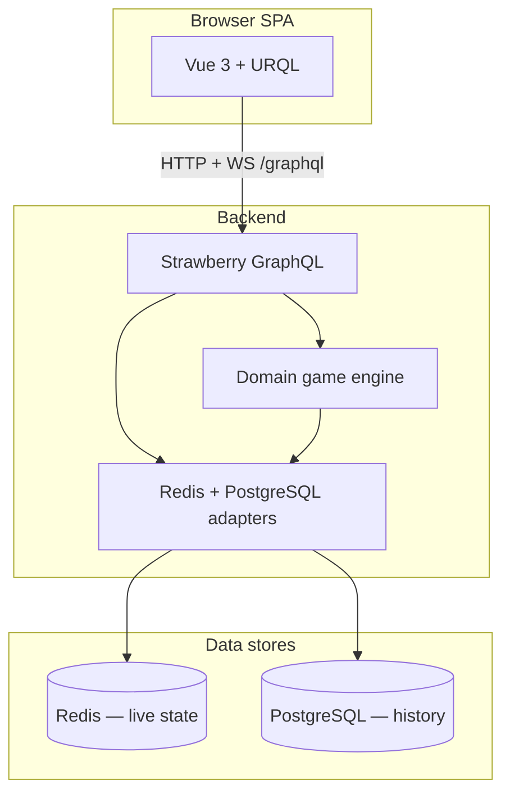

# Architecture Overview

## System Boundaries



| Layer | Location | Responsibility |
|---|---|---|
| Frontend | `frontend/src/` | Lobby, game UI, guest session persistence, GraphQL client |
| GraphQL API | `backend/app/graphql/` *(planned)* | Schema, resolvers, subscriptions, DataLoaders |
| Domain | `backend/app/domain/` *(planned)* | Pure 6 Nimmt rules — no I/O |
| Infrastructure | `backend/app/infrastructure/` *(planned)* | Redis room state, pub/sub, SQLModel persistence |
| Config / entry | `backend/app/config.py`, `main.py` | Settings, CORS, FastAPI app wiring |

## Current Scaffold (Implemented)

The repository has a runnable dev skeleton:

- **Backend:** FastAPI app with Strawberry GraphQL at `/graphql` and a `health` query returning `"ok"`.
- **Frontend:** Vue 3 + Vite + Tailwind CSS v4 + URQL client stub at `src/graphql/client.ts`.
- **Infrastructure:** `docker-compose.yml` with Postgres 16, Redis 7, backend, and frontend services.
- **Config:** `.env.example` files in `backend/` and `frontend/`; copy to `.env` before local runs.

Game logic, auth, Redis state, subscriptions, and PostgreSQL models are **not implemented yet** — see [README.md](./README.md) implementation order.

## Data Flow (Target)

### Live play

1. Client calls `ensureGuestSession` → server stores session hash in Redis.
2. Host `createRoom` / guest `joinRoom` → Redis `GameRoomState` created/updated.
3. Client subscribes to `myGameViewUpdated(roomId)` → receives **player-specific** view (hand visible, others hidden).
4. All players `submitCard` during `SUBMIT` → server records submissions atomically in Redis.
5. When all submissions received → domain engine resolves placement → Redis state updated → pub/sub pushes new views.
6. On `FINISHED` → optional snapshot persisted to PostgreSQL.

### Information visibility

- **Public:** rows, player names, bones totals, hand counts, submission flags.
- **Private (per player):** `myHand`, own submitted card during `SUBMIT`.
- **Never exposed pre-resolve:** other players' chosen cards.

See [graphql-schema.md](./graphql-schema.md) and [auth.md](./auth.md).

## Layer Rules

1. **Domain is pure** — No Redis, SQL, or FastAPI imports in `backend/app/domain/`.
2. **Resolvers orchestrate** — GraphQL layer validates auth/phase, calls domain + infrastructure.
3. **Redis is hot path** — Active games never read PostgreSQL mid-round.
4. **Subscriptions fan-out from Redis pub/sub** — One internal event → N player-specific GraphQL payloads.
5. **Async throughout** — `async def` resolvers, async Redis/DB clients; no blocking I/O.

## Phase Pub/Sub

When room phase or turn state changes:

```
Mutation / timer
  → update Redis GameRoomState
  → PUBLISH room:{roomId}:channel
  → subscription resolver builds MyGameView per connected guest
  → graphql-ws pushes to clients
```

Details: [state-management.md](./state-management.md).

## Cross-References

- Deployment & local dev: [deployment.md](./deployment.md)
- Game rules: [game-logic.md](./game-logic.md)
- GraphQL types: [graphql-schema.md](./graphql-schema.md)
- Redis keys: [state-management.md](./state-management.md)
- Postgres models: [database-schema.md](./database-schema.md)
- Frontend screens & design tokens: [frontend-design.md](./frontend-design.md)
