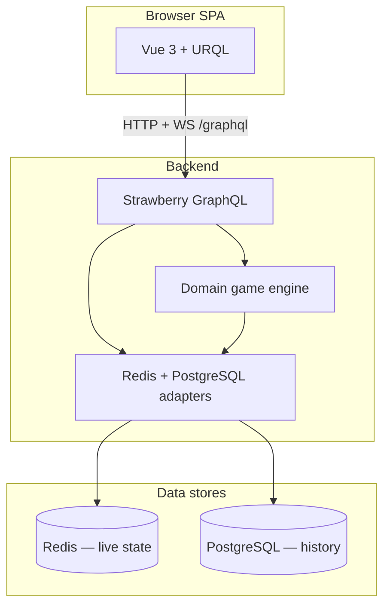

# Architecture Overview

## System Boundaries



| Layer | Location | Responsibility |
|---|---|---|
| Frontend | `frontend/src/` | Lobby, game UI, guest session persistence, GraphQL client |
| GraphQL API | `backend/app/graphql/` *(M3 — complete)* | Schema, resolvers, subscriptions, public/private view builders |
| Domain | `backend/app/domain/` *(M1 — complete)* | Pure BARE BONES / Take 6 rules — no I/O |
| Infrastructure | `backend/app/infrastructure/` *(M2 — complete)* | Redis sessions/rooms/game loop, pub/sub, timers, guest auth |
| Config / entry | `backend/app/config.py`, `main.py` | Settings, CORS, FastAPI lifespan, GraphQL router + WS context |

## Current Implementation Status

**Last reviewed:** 2026-05-23 (M5 manual QA complete on `cursor/m4-frontend-core`)

| Layer | Status | Notes |
|---|---|---|
| Domain (M1) | ✅ Complete | Pure rules + unit tests in `backend/app/domain/` |
| Infrastructure (M2) | ✅ Complete | Redis orchestration; per-room turn timer; exposed via GraphQL resolvers |
| GraphQL API (M3) | ✅ Complete | Queries, mutations, subscriptions in `backend/app/graphql/`; 11 GraphQL tests |
| Frontend (M4) | ✅ Complete on branch | Router, composables, Home/Lobby/Game views on `cursor/m4-frontend-core` |
| M6 UX polish | ✅ Largely complete | Sprints A–C shipped; a11y + SFX remain |
| PostgreSQL | ⬜ Declared only | `DATABASE_URL` in config; no models, migrations, or runtime usage |
| Playable MVP (M5) | ✅ Complete | Manual two-browser QA passed on branch |

**Runnable today:**

- **Backend:** FastAPI + Strawberry at `/graphql` — guest sessions, room lifecycle, game mutations, and WS subscriptions; Redis lifespan + pub/sub listener in `main.py`.
- **Frontend:** Vue 3 SPA with URQL HTTP + graphql-ws — guest session bootstrap, lobby, live game UI, subscriptions (`frontend/src/`).
- **Infrastructure:** `docker-compose.yml` with Postgres 16, Redis 7, backend, frontend.
- **Tests:** `pytest` — 82 pass against real Redis (DB 15 in tests); frontend `npm run build` passes; no CI pipeline yet.

**Rough completeness:** **Playable MVP met.** ~95% toward portfolio-ready demo; M6 polish + merge remain.

See [roadmap.md](./roadmap.md) for milestone checklist and [Known Gaps](#known-gaps--mvp-blockers) below.

## Known Gaps & MVP Blockers

Remaining deferrals after M5. Track fixes in [roadmap.md](./roadmap.md) unless noted as M7 backlog.

| Gap | Impact | Target fix |
|---|---|---|
| **`is_connected` vs domain `is_active`** | Adapter always sets `is_active=True`; disconnect only flips `is_connected`; all seated players block submit barrier until timeout | Document v1 behavior; reconcile later |
| **`version` bumped, never checked** | No optimistic concurrency on read-modify-write | Acceptable for single worker; Redis WATCH or version check in M7 |
| **In-process locks & timers** | `asyncio.Lock`, timer tasks, `SubscriberRegistry` are process-local | Single uvicorn worker for MVP; M7 multi-worker hardening |
| **`SESSION_SECRET` unused** | Tokens are UUID + opaque bearer + SHA-256 hash (Option A), not JWT | Keep for optional JWT (Option B) or remove when cleaning config |
| **PostgreSQL unused** | No match history persistence | M2.7 / S8 — non-blocking for MVP demo |
| **OpenAPI spec lag** | `openapi.yaml` missing rematch / turn-timer fields | GraphQL + `.cursor/graphql-schema.md` are authoritative |
| **CI pipeline** | No automated test runs on push | M7 backlog |

**Playable MVP (M5) is complete.** Next: merge branch, M6 polish, optional Postgres/CI.

## Data Flow (Live Play)

1. Client calls `ensureGuestSession` → server stores session hash in Redis.
2. Host `createRoom` / guest `joinRoom` → Redis `GameRoomState` created/updated.
3. Client subscribes to `myGameViewUpdated(roomId)` → receives **player-specific** view (hand visible, others hidden).
4. All players `submitCard` during `SUBMIT` → server records submissions atomically in Redis.
5. When all submissions received → domain engine resolves placement → Redis state updated → pub/sub pushes new views.
6. On `FINISHED` → client shows `ResultsOverlay`; **Rematch** calls `returnToLobby` → `LOBBY` for another game. Optional PostgreSQL snapshot (not implemented yet).

### Information visibility

- **Public:** rows, player names, bones totals, hand counts, submission flags.
- **Private (per player):** `myHand`, own submitted card during `SUBMIT`.
- **Never exposed pre-resolve:** other players' chosen cards.

Enforced in `backend/app/graphql/views.py` and covered by `test_no_hand_leakage_in_public_room`.

See [graphql-schema.md](./graphql-schema.md) and [auth.md](./auth.md).

## Layer Rules

1. **Domain is pure** — No Redis, SQL, or FastAPI imports in `backend/app/domain/`.
2. **Resolvers orchestrate** — GraphQL layer validates auth/phase, calls domain + infrastructure.
3. **Redis is hot path** — Active games never read PostgreSQL mid-round.
4. **Subscriptions fan-out from Redis pub/sub** — One internal event → N player-specific GraphQL payloads.
5. **Async throughout** — `async def` resolvers, async Redis/DB clients; no blocking I/O.

## Phase Pub/Sub

When room phase or turn state changes:

```
Mutation / timer
  → update Redis GameRoomState
  → PUBLISH room:{roomId}:channel
  → subscription resolver builds MyGameView per connected guest
  → graphql-ws pushes to clients
```

Details: [state-management.md](./state-management.md).

## Cross-References

- Milestones & task checklist: [roadmap.md](./roadmap.md)
- Deployment & local dev: [deployment.md](./deployment.md)
- Game rules: [game-logic.md](./game-logic.md)
- GraphQL types: [graphql-schema.md](./graphql-schema.md)
- Redis keys: [state-management.md](./state-management.md)
- Postgres models: [database-schema.md](./database-schema.md)
- Frontend screens & design tokens: [frontend-design.md](./frontend-design.md)
