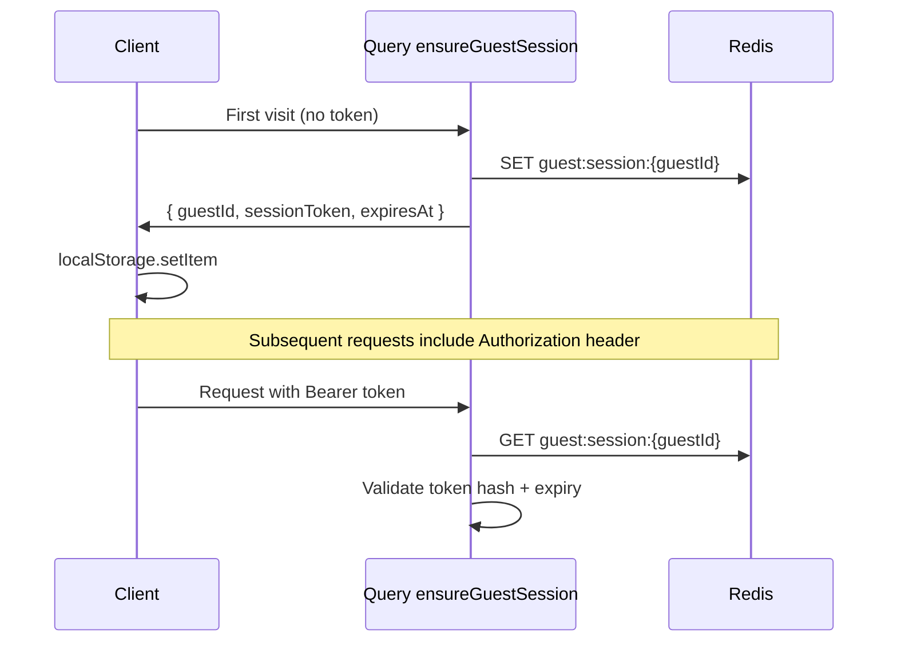

# Authentication — Anonymous Guest Sessions

## v1 Scope

- **No** user accounts, passwords, OAuth, or email
- Each browser gets a **guest identity** (`guestId`) and **session token** (`sessionToken`)
- Tokens authorize GraphQL HTTP and WebSocket connections
- Display name is cosmetic and set per room join

## Session Lifecycle



## Issued Credentials

```graphql
type GuestSession {
  guestId: ID!
  sessionToken: String!   # Opaque bearer token — only returned once per creation/refresh
  expiresAt: DateTime!
}
```

### Storage

| Location | Key | Value |
|---|---|---|
| Browser `localStorage` | `6nimmt_guest` | JSON `{ guestId, sessionToken, expiresAt }` |
| Redis | `guest:session:{guestId}` | See below |

### Redis session document

```json
{
  "guestId": "uuid",
  "tokenHash": "sha256(...)",
  "createdAt": "ISO8601",
  "expiresAt": "ISO8601",
  "lastSeenAt": "ISO8601",
  "displayName": "optional default"
}
```

**Never store raw tokens in Redis** — store `SHA-256(sessionToken)` only.

## Client Transport

### HTTP (queries & mutations)

```
Authorization: Bearer <sessionToken>
X-Guest-Id: <guestId>          # Optional redundancy for debugging; token is authoritative
```

### WebSocket (subscriptions)

Use `graphql-ws` `connectionParams`:

```typescript
connectionParams: () => ({
  authorization: `Bearer ${session.sessionToken}`,
})
```

Backend reads the same validation path as HTTP middleware.

## Backend Validation Middleware

```python
async def get_current_guest(request) -> GuestContext:
    token = extract_bearer(request)
    if not token:
        raise Unauthenticated

    guest_id = extract_guest_id(request)  # from token payload or lookup
    session = await redis.get_session(guest_id)

    if not session or not verify_hash(token, session.token_hash):
        raise Unauthenticated
    if session.expires_at < now():
        raise SessionExpired

    await redis.touch_session(guest_id)
    return GuestContext(guest_id=guest_id, ...)
```

Fail closed: missing/invalid → GraphQL error extension `UNAUTHENTICATED`.

## Token Format Options

**Recommended (portfolio-simple):**

- `guestId` = UUID v4
- `sessionToken` = `secrets.token_urlsafe(32)`
- Lookup: client sends token; server scans guestId from parallel header **or** embed guestId in signed JWT

**Option A — UUID + opaque token (chosen):**

- Client stores both; sends `Authorization: Bearer {token}` and `X-Guest-Id: {guestId}`
- Server loads `guest:session:{guestId}`, verifies hash

**Option B — Single JWT:**

- Payload: `{ sub: guestId, exp }`, signed with server secret
- Simpler headers but adds PyJWT dependency

Stick with **Option A** for clarity in a portfolio write-up.

## Display Names

- Set via `joinRoom(displayName)` or `createRoom(displayName)`
- Max length: **32** characters
- Allowed: alphanumeric, spaces, hyphen, underscore
- Strip leading/trailing whitespace; reject empty
- No uniqueness enforced (multiple "Guest" allowed)

## Authorization Rules

| Action | Requirement |
|---|---|
| `createRoom` | Valid guest session |
| `joinRoom` | Valid guest session |
| `startGame` | Seated player + `isHost` |
| `submitCard` | Seated player + correct phase |
| `myGameView` | Seated in room |
| `myGameViewUpdated` | Seated in room; filter private fields |

Guests **not** in a room may still call `ensureGuestSession` and `roomByCode` (public lobby peek — optional restrict to seated only post-MVP).

## Reconnect & Identity Recovery

1. Client loads `localStorage` session
2. If expired → call `ensureGuestSession` (creates **new** guest — old seat lost unless post-MVP seat recovery)
3. If valid → reconnect WebSocket, call `myGameView(roomId)`
4. Server matches `guestId` to seat in Redis room → mark `isConnected = true`

**Portfolio limitation:** Clearing localStorage mid-game creates a new guest — acceptable for v1; document in UI.

## Session Expiry

- Default TTL: **7 days** sliding window
- Refresh `lastSeenAt` on each authenticated request
- `ensureGuestSession`: if valid session exists, return same credentials; if expired, mint new guest

## Security Notes ( proportionate for local portfolio )

| Topic | Approach |
|---|---|
| HTTPS | Not required locally; use `http://localhost` |
| CSRF | Bearer token in header — not cookie — CSRF N/A |
| Token theft | Out of scope locally; don't log tokens |
| Rate limiting | Optional FastAPI middleware post-MVP |
| Room codes | 6 chars, uppercase alphanumeric, ~2B combinations — sufficient |

## Cross-References

- GraphQL auth errors: [graphql-schema.md](./graphql-schema.md)
- Client storage: [frontend-patterns.md](./frontend-patterns.md)
- Redis keys: [state-management.md](./state-management.md)
