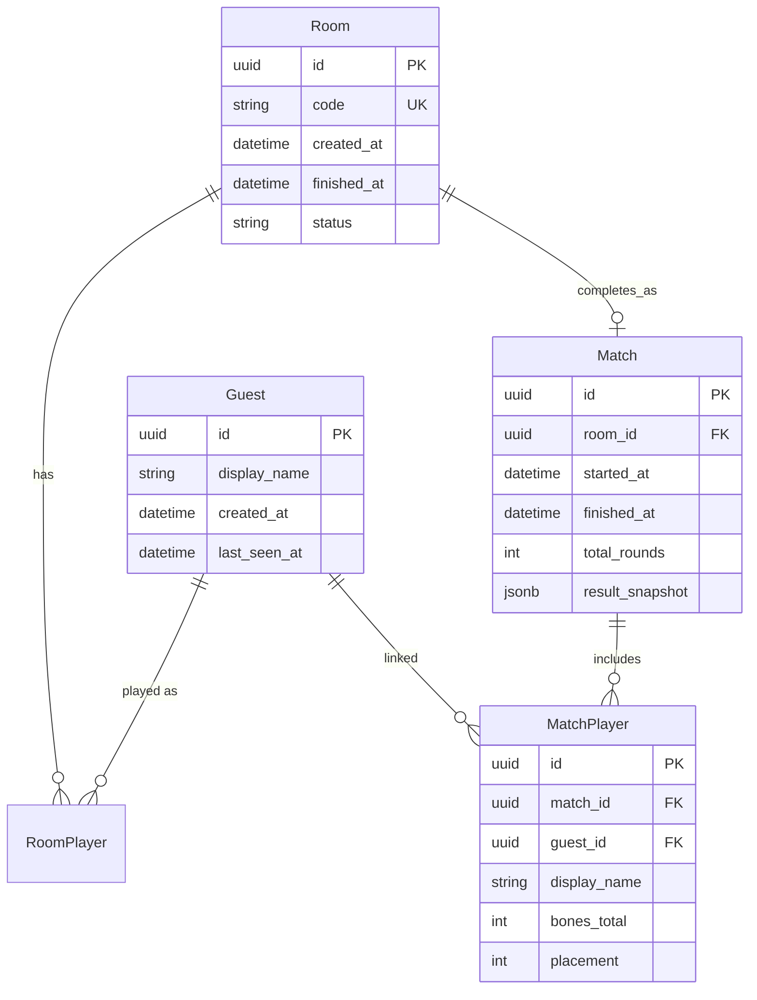

# Database Schema (PostgreSQL)

## Scope (v1)

PostgreSQL is **not** required for the core multiplayer demo loop — Redis alone can run live games. Persist to PostgreSQL when:

- A game reaches `FINISHED` (match record for portfolio showcase)
- Guest display names / stats are needed across sessions (post-MVP)

For v1, implement a **minimal schema** so migrations and SQLModel patterns exist without blocking gameplay.

## ORM Stack

- **SQLModel** (Pydantic + SQLAlchemy 2.x)
- **asyncpg** driver via `create_async_engine`
- **Alembic** for migrations

## Entity Relationship



## Table Definitions

### `guest`

Mirrors anonymous identity for history linkage. Session tokens stay in Redis only.

| Column | Type | Notes |
|---|---|---|
| `id` | UUID PK | Same as `guestId` issued at session creation |
| `display_name` | VARCHAR(32) | Last used name |
| `created_at` | TIMESTAMPTZ | |
| `last_seen_at` | TIMESTAMPTZ | Updated on each authenticated request |

### `room`

| Column | Type | Notes |
|---|---|---|
| `id` | UUID PK | |
| `code` | VARCHAR(6) UNIQUE | Join code |
| `status` | VARCHAR(16) | `LOBBY`, `ACTIVE`, `FINISHED`, `ABANDONED` |
| `created_at` | TIMESTAMPTZ | |
| `finished_at` | TIMESTAMPTZ NULL | |

> Live gameplay state remains in Redis; this row is metadata + lifecycle audit.

### `match`

Written once when game finishes.

| Column | Type | Notes |
|---|---|---|
| `id` | UUID PK | |
| `room_id` | UUID FK → room.id | |
| `started_at` | TIMESTAMPTZ | |
| `finished_at` | TIMESTAMPTZ | |
| `total_rounds` | INT | |
| `result_snapshot` | JSONB | Final rows optional; full player scores required |

**`result_snapshot` example:**

```json
{
  "winnerIds": ["player-uuid-1"],
  "players": [
    { "playerId": "...", "displayName": "Guest-A1", "bonesTotal": 12, "placement": 1 }
  ]
}
```

### `match_player`

Normalized scores for querying leaderboards later.

| Column | Type | Notes |
|---|---|---|
| `id` | UUID PK | |
| `match_id` | UUID FK | |
| `guest_id` | UUID FK NULL | Nullable if guest purged |
| `display_name` | VARCHAR(32) | Denormalized for history |
| `bones_total` | INT | |
| `placement` | INT | 1 = best |

## SQLModel Reference (Sketch)

```python
class Guest(SQLModel, table=True):
    __tablename__ = "guest"
    id: UUID = Field(default_factory=uuid4, primary_key=True)
    display_name: str = Field(max_length=32)
    created_at: datetime = Field(default_factory=utcnow)
    last_seen_at: datetime = Field(default_factory=utcnow)

class Match(SQLModel, table=True):
    __tablename__ = "match"
    id: UUID = Field(default_factory=uuid4, primary_key=True)
    room_id: UUID = Field(foreign_key="room.id")
    started_at: datetime
    finished_at: datetime
    total_rounds: int
    result_snapshot: dict = Field(sa_column=Column(JSONB))
```

## Write Path

```
Game phase → FINISHED (in Redis)
  → Async task: persist Match + MatchPlayer rows
  → Optional: trim Redis room TTL to 1h
```

Persistence failure must **not** block showing results to players — log error, retry.

## Queries (Post-MVP / Portfolio Extras)

```graphql
# Future — not v1 blocking
# recentMatches(limit: 10): [MatchSummary!]!
# guestStats(guestId: ID!): GuestStats
```

## Migrations

```
backend/
  alembic/
    versions/
  alembic.ini
```

Initial migration: all four tables. Seed data not required.

## Indexing

| Table | Index | Reason |
|---|---|---|
| `room` | `code` UNIQUE | Join lookup |
| `match` | `room_id` | History by room |
| `match_player` | `guest_id` | Guest stats |
| `match` | `finished_at DESC` | Recent matches list |

## Cross-References

- Redis live state: [state-management.md](./state-management.md)
- Guest IDs: [auth.md](./auth.md)
- Docker Postgres service: [deployment.md](./deployment.md)
