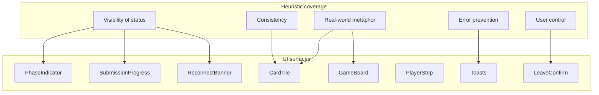

# Frontend Design

Single source of truth for **screen-level UX**, visual language, motion, and accessibility decisions for the 6-Nimmt Vue 3 SPA. Implementation conventions live in [frontend-patterns.md](./frontend-patterns.md); tooling lives in [frontend-stack.md](./frontend-stack.md).

## Locked Design Decisions

| Area | Choice |
|---|---|
| Theme | **Dark-first** — moody table-top, vibrant card faces |
| Responsive | **Desktop-first** — mobile shows a "best on larger screen" notice |
| Motion | **Moderate** — hover lift, staggered resolve, progress pulse |
| Board layout | **Vertical stack** — 4 horizontal rows |
| End-of-game | **Overlay on GameView** (primary); `/results` deep-link alias |
| Icons | **Lucide Vue** (`lucide-vue-next`) |
| Audio | **Optional SFX**, muted by default |

## Design System

### Surfaces & Chrome

```css
:root {
  --color-surface: #0c0c0f;        /* App background — near-black */
  --color-surface-raised: #16161a; /* Panels, player strip */
  --color-felt: #1a2e1a;           /* Subtle green tint behind board */
  --color-border: #2a2a32;
  --color-text: #f4f4f5;
  --color-muted: #a1a1aa;
  --color-accent: #d4a017;         /* Amber — table lamp / CTA accent */
  --color-danger: #ef4444;         /* Penalties, errors */
  --color-success: #22c55e;        /* Submitted, connected */
}
```

Typography: **Inter** (via `@fontsource/inter`) for headings and HUD; tabular numerals (`font-variant-numeric: tabular-nums`) for card values and scores so digits don't jitter on score animations.

In-game HUD uses at most **two font sizes** to preserve a calm reading hierarchy.

### Card Chroma (Vibrant, Value-Driven)

Card faces stay readable on dark felt via **hue bands** (predictable by value) and **bull-head intensity** (severity cue):

| Card range | Face hue | Tailwind sketch |
|---|---|---|
| 1–26 | Cool blue-violet | `from-indigo-500 to-violet-600` |
| 27–52 | Teal-green | `from-teal-500 to-emerald-600` |
| 53–78 | Amber-orange | `from-amber-500 to-orange-600` |
| 79–104 | Rose-red | `from-rose-500 to-red-600` |

| Bull heads | Indicator |
|---|---|
| 1 | Single dot, low opacity |
| 2 | Double dot |
| 3 (multiples of 10) | Triple dot |
| 5 (multiples of 11) | Solid ring outline |
| 7 (card 55) | Solid ring + soft pulse on hover |

`CardTile.vue` derives both via computed properties from `value` and `bullHeads`. Numbers render white with a subtle inner shadow for a "physical tile" depth — never decorative cow imagery.

## Nielsen Heuristics Coverage

| # | Heuristic | Where it shows up |
|---|---|---|
| 1 | Visibility of system status | `PhaseIndicator`, `SubmissionProgress`, connection dots, round counter, optional submit countdown |
| 2 | Match real world | Vertical rows mirror a tabletop; large numbers; bull heads as dot/ring severity |
| 3 | User control & freedom | Leave room with confirm; edit display name in lobby; copy code/link; SFX toggle |
| 4 | Consistency & standards | Shared `AppShell`, one button variant set, `CardTile` reused in hand + board + resolve feed |
| 5 | Error prevention | `Start game` disabled below 2 players; hand locks after submit; host-only actions |
| 6 | Recognition over recall | Room code always visible; opponent submission shown as colored dots |
| 7 | Flexibility & efficiency | Copy link/code; keyboard `1`–`N` selects nth card (nice-to-have) |
| 8 | Aesthetic & minimalist | Dark chrome; vibrant color reserved for play surfaces; max two HUD font sizes |
| 9 | Error recovery | Reconnect banner with auto-retry; mutation toasts surface `GameError.message` |
| 10 | Help & documentation | Collapsible "How to play" drawer on Home + Lobby with 3 bullets + Rule C note |



## Screens

### 1. HomeView — `/`

Zero-friction entry: create or join a room without an account.

```
┌─────────────────────────────────────┐
│  6 Nimmt          [SFX toggle off]  │
│                                     │
│     ┌─────────────────────────┐     │
│     │  Your name              │     │
│     └─────────────────────────┘     │
│     [ Create room ]  (accent)       │
│                                     │
│     ─── or join ───                 │
│     ┌──┐ ┌──┐ ┌──┐ ┌──┐ ┌──┐ ┌──┐   │
│     │A │ │B │ │1 │ │2 │ │C │ │D │   │
│     └──┘ └──┘ └──┘ └──┘ └──┘ └──┘   │
│     [ Join room ]                   │
│                                     │
│     ▸ How to play                   │
└─────────────────────────────────────┘
```

- **Layout:** centered column, `max-w-md`.
- **Reactive:** `ensureGuestSession` boot spinner → skeleton name field; inline validation on empty name or invalid 6-char code.
- **Micro-delights:** Create button amber glow on hover; room-code inputs auto-advance focus on keystroke; successful join fades into Lobby (150ms).
- **Mobile:** Full-width `MobileDesktopNotice` banner: *"6 Nimmt is designed for desktop. You can browse, but gameplay works best on a larger screen."*

### 2. LobbyView — `/room/:roomId/lobby`

Social waiting room; host starts the game.

```
┌────────────────────────────────────────────────────────────┐
│ ← Leave    Room AB12CD    [Copy link]  [Copy code]         │
├──────────────────────────────┬─────────────────────────────┤
│  Players (4/10)              │  Waiting for host…          │
│  ● Alice  (host)             │                             │
│  ● You                       │  Min 2 players to start     │
│  ○ Bob    (away)             │                             │
│  [ Edit name ]               │  [ Start game ] (host only) │
│                              │  or "Host will start…"      │
└──────────────────────────────┴─────────────────────────────┘
```

- **Layout:** two-column on `lg+`, single column fallback.
- **Reactive:** `myGameViewUpdated` drives player list, `isConnected` dots, host badge; phase auto-navigates to `/play` once `phase >= SUBMIT`.
- **Micro-delights:** Copy code swaps the icon to Lucide `Check` + toast "Copied"; new player joins slide into the list (150ms); host's `Start game` button gains an amber pulse once at least 2 players are connected.

### 3. GameView — `/room/:roomId/play`

The core experience. Desktop-first vertical board.

```
┌────────────────────────────────────────────────────────────┐
│ Round 3/8   SUBMIT   3/4 submitted   [SFX]   [Leave]       │
├────────────────────────────────────────────────────────────┤
│  PlayerStrip: names · penalty totals · submit dots         │
├────────────────────────────────────────────────────────────┤
│        ┌─ felt surface ──────────────────────────┐         │
│  Row 1 │ [12][19][24][31][38]                    │         │
│  Row 2 │ [7][15]                                 │         │
│  Row 3 │ [44][51][58]                            │         │
│  Row 4 │ [3][9]                                  │         │
│        └─────────────────────────────────────────┘         │
├────────────────────────────────────────────────────────────┤
│  Your hand (sorted ascending)                              │
│  [23] [47] [62] [88] [91] [97]   ← hover lift, click play  │
└────────────────────────────────────────────────────────────┘
```

- **Interaction model:** Single-click submit. Selected card lifts and gains an amber ring; the rest of the hand dims and locks while the mutation resolves (optimistic — see [frontend-patterns.md](./frontend-patterns.md#optimistic-submit-flow)).
- **Rule C copy:** When the played card is lower than all row tails, surface a toast in the resolve feed: *"Card too low — auto-collected row with fewest bull heads."*
- **Transient phases (`DEAL`, `RESOLVE`, `SCORE`):** `GamePhaseOverlay` shows a shimmer + phase label to prevent interaction flash.

Reactive elements driven by the subscription payload:

| Signal | UI response |
|---|---|
| `phase === SUBMIT` | Enable hand; show countdown if backend exposes a deadline (else client estimate from `updatedAt`) |
| `mySubmittedCard` set | Lock hand; show face-up mini tile near player strip |
| `submissionProgress` | Bar + numeric; pulse on increment |
| `lastResolvedPlays` | `ResolveFeed` staggers card → row arrow → penalty badge (120ms/card) |
| Row affected | `GameRow` highlight: amber wash fade (200ms) |
| Opponent `hasSubmitted` | Dot turns green; no card value leaked |

### 4. Results Overlay — phase `FINISHED`

Primary end-game UX is an overlay on `GameView` (backdrop-blur, dimmed board). `/room/:roomId/results` exists as a shareable deep-link that mounts the same overlay over a frozen view.

```
┌─────────────────────────────────────┐
│           Game over                 │
│                                     │
│   🏆 Alice — 23 pts                 │
│      Bob   — 31 pts                 │
│      You   — 45 pts                 │
│                                     │
│  [ Back to lobby ]  [ Leave room ]  │
└─────────────────────────────────────┘
```

- **Micro-delights:** Winner row carries a subtle gold left border; score numbers count up (400ms). No confetti — stays in the minimalist register.
- **Ties:** Shared first place — both rows get the gold border and trophy icon.

## Motion Catalog

| Moment | Animation | Duration | Reduced-motion fallback |
|---|---|---|---|
| Card hover | `translateY(-4px)` + soft shadow | 150ms | Opacity change only |
| Card select | Amber ring scale-in | 120ms | Border color swap |
| Submit lock | Hand fades to `opacity: 0.5`; selected stays at 1 | 200ms | Instant state swap |
| Progress tick | Bar segment pulse on increment | 300ms | Static update |
| Resolve reveal | Stagger fade + slide per `ResolvedPlay` | 120ms × n | All at once |
| Row highlight | Background amber wash 10% → 0% | 200ms | 2px border flash |
| Copy code | Icon swap to `Check` | 200ms | Toast only |
| Penalty increment | Tabular tick / flip on score number | 400ms | Instant replace |
| Player joins lobby | List item slide-in | 150ms | Static insert |

All transitions honor `@media (prefers-reduced-motion: reduce)` by swapping the column above. Color and state changes still happen so feedback is preserved.

## Optional SFX

Muted by default. Preference persists in `localStorage` (`sfxEnabled`) via `@vueuse/core` `useLocalStorage`. Never autoplay before the user opts in (browser autoplay policy compliance).

| Event | Character | Volume |
|---|---|---|
| Card select | Soft tap | Low |
| Submit confirm | Short chime | Low |
| Penalty taken | Muted thud | Medium |
| Round resolve complete | Soft sweep | Low |
| Game won | Single warm note | Medium |

Assets live in `frontend/public/sfx/`. Triggered via the Web Audio API for minimal latency.

## Accessibility Checklist

- All card buttons expose `aria-pressed` when selected and `aria-disabled` while the hand is locked.
- Toasts use `role="status"` (info) or `role="alert"` (error).
- Reconnect banner uses `role="status"` + `aria-live="polite"`.
- Color is never the only signal — connection state pairs the dot color with text/title; penalties surface a number, not just red.
- Contrast: card numbers must hit WCAG AA against their gradient face (verify each hue band manually during implementation).
- Keyboard: `Tab` cycles the hand; number keys `1`–`N` select the nth visible card; `Enter` or `Space` submits the selected card.
- Focus rings are visible on dark surfaces — use the amber accent at 60% opacity.

## Component Tree Additions

These complement the existing list in [frontend-patterns.md](./frontend-patterns.md#directory-structure):

```
components/
  layout/
    AppShell.vue
    MobileDesktopNotice.vue
    SfxToggle.vue
  lobby/
    RoomHeader.vue
    PlayerList.vue
    CopyRoomActions.vue
    RulesDrawer.vue
  game/
    ResolveFeed.vue        # Staggers lastResolvedPlays
    SubmitCountdown.vue    # Activated if backend exposes a deadline
    GamePhaseOverlay.vue   # DEAL / RESOLVE / SCORE shimmer
    ResultsOverlay.vue     # FINISHED modal
  feedback/
    ReconnectBanner.vue
    ToastHost.vue
    ConfirmDialog.vue
```

## Cross-References

- Vue conventions and composables: [frontend-patterns.md](./frontend-patterns.md)
- Tooling and dependencies: [frontend-stack.md](./frontend-stack.md)
- GraphQL types behind the reactive UI: [graphql-schema.md](./graphql-schema.md)
- Game rules driving phase copy and Rule C: [game-logic.md](./game-logic.md)
