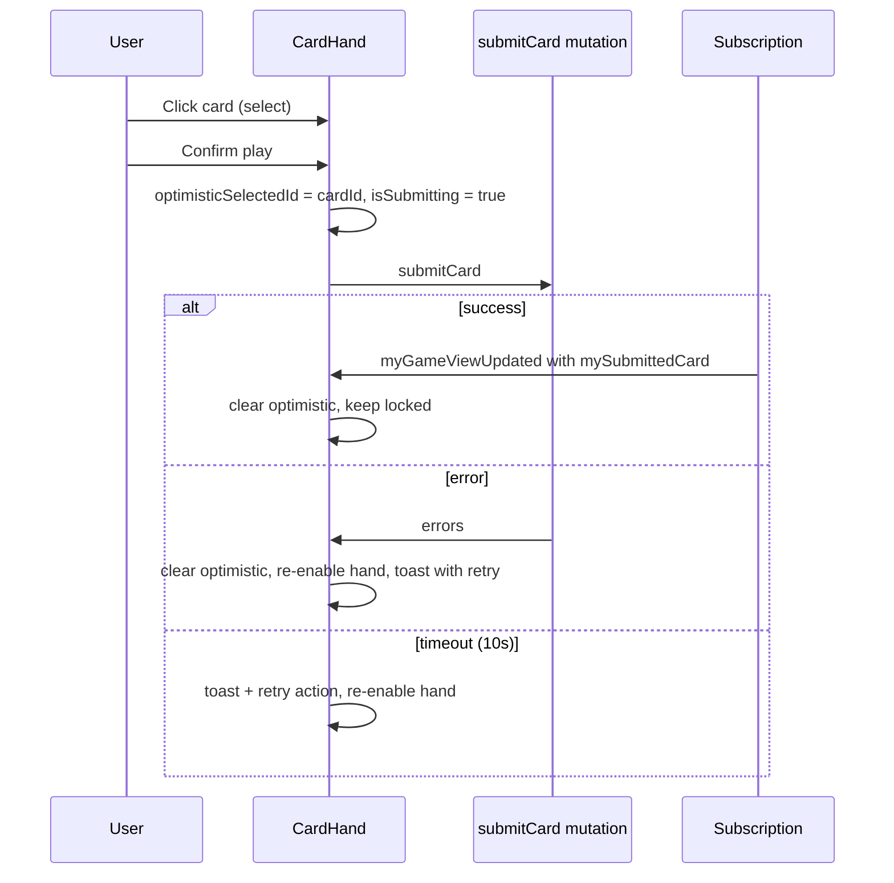

# Frontend Patterns

## Philosophy

- **Subscription as source of truth** for in-game UI — do not duplicate live state in Pinia
- **Optimistic UI** only for `submitCard` (disable hand, show selection until subscription confirms)
- **Warm editorial palette** — light body (`#FFE7E0`), dark header and type (`#7D3623`); card faces use **bone-tier solids** (see [design-tokens.md](./design-tokens.md))
- **Desktop-first** — mobile gets a `MobileDesktopNotice` banner
- **Moderate motion** — existing queue + hand lift; honor `prefers-reduced-motion`
- **Composition API** — all new components use `<script setup lang="ts">`

> Screen-level UX lives in [frontend-design.md](./frontend-design.md). **Tokens:** [design-tokens.md](./design-tokens.md). **Visual refresh plan:** [visual-identity-implementation.md](./visual-identity-implementation.md). **SFX:** [sfx-design.md](./sfx-design.md).

## Directory Structure

**Current scaffold** (exists today):

```
frontend/src/
  main.ts
  App.vue                 # Placeholder — light neutral landing, not dark design spec
  style.css               # @import "tailwindcss" only
  vite-env.d.ts
  graphql/
    client.ts             # URQL + graphql-ws; no operations called yet
  lib/
    guest-session.ts      # Reads 6nimmt_guest from localStorage; does NOT mint sessions
    sfx/                  # M6.16 — types, catalog, engine (no Vue imports)
```

**Gap:** Nothing writes to `localStorage` until M4 `useGuestSession` calls GraphQL `ensureGuestSession`.

**Target layout** (add as features land):

```
frontend/src/
  router/index.ts
  graphql/
    operations/
      session.graphql
      room.graphql
      game.graphql
    generated/           # codegen output
  composables/
    useGuestSession.ts
    useGameRoom.ts
    useCardSelection.ts
    useSfx.ts               # Typed play('ui.click'); reads nimmt:sfxEnabled
  components/
    layout/
      AppShell.vue
      MobileDesktopNotice.vue   # Desktop-first; banner on small viewports
      SfxToggle.vue             # Header control; persists sfxEnabled in localStorage
    game/
      CardTile.vue
      CardHand.vue
      GameRow.vue
      GameBoard.vue
      PlayerStrip.vue
      PhaseIndicator.vue
      ResolveFeed.vue           # Staggered lastResolvedPlays reveal
      SubmitCountdown.vue       # Circular countdown from room.submitDeadline
      GamePhaseOverlay.vue      # DEAL / RESOLVE / SCORE shimmer
      ResultsOverlay.vue        # FINISHED modal — tie ranks, Rematch + Exit room
    lobby/
      RoomCodeInput.vue
      CreateRoomForm.vue
      RoomHeader.vue
      PlayerList.vue
      CopyRoomActions.vue
      RulesDrawer.vue
    feedback/
      ReconnectBanner.vue
      ToastHost.vue
      ConfirmDialog.vue
  views/
    HomeView.vue         # Create / join
    LobbyView.vue        # Waiting room
    GameView.vue         # Active play + ResultsOverlay on FINISHED
    ResultsView.vue      # Deep-link alias that mounts ResultsOverlay over a frozen view
```

## Routing

| Path | View | Auth | Notes |
|---|---|---|---|
| `/` | HomeView | Auto `ensureGuestSession` | Create or join entry |
| `/room/:roomId/lobby` | LobbyView | Guest + seated | Auto-advances to `/play` when `phase >= SUBMIT` |
| `/room/:roomId/play` | GameView | Guest + seated | Mounts `ResultsOverlay` when `phase === FINISHED` |
| `/room/:roomId/results` | ResultsView | Guest + FINISHED | Deep-link alias that renders `ResultsOverlay` over a frozen view; not the happy-path |

Redirect `/room/:id/play` → `/lobby` if phase is `LOBBY`. Primary end-of-game UX is the overlay on `GameView`; the `/results` route exists so a final score can be shared by URL.

## Composables

### `useGuestSession`

```typescript
// Responsibilities:
// - Load/persist localStorage via @vueuse/core useLocalStorage
// - Call ensureGuestSession on app boot if missing/expired
// - Expose { guestId, sessionToken, isReady, refreshSession }
```

Boot in `App.vue` or router guard before any GraphQL call.

### `useGameRoom(roomId)`

```typescript
// Responsibilities:
// - Subscribe to myGameViewUpdated(roomId)
// - Expose reactive refs: room, myHand, mySubmittedCard, phase, players, rows
// - Methods: submitCard(cardId), leaveRoom(), returnToLobby(), updateSubmitTimeout(seconds), startGame()
// - On subscription payload: replace entire view (version check optional)
// - Tear down subscription on unmount
```

**Do not** merge partial subscription patches manually in v1 — full payload replacement is simpler and less bug-prone.

### `useCardSelection`

Local UI state for hover/selected card **before confirm**. Clears when `mySubmittedCard` becomes non-null from server.

Flow: click card → `selectCard` → user confirms via confirm bar → `submitSelectedCard`. On client deadline with a selection pending, auto-call `submitSelectedCard`.

### `useGameShortcuts` (M6)

Scoped keyboard handler for `GameView`:

- `1`–`N` → `selectCardByIndex`
- `Enter` → confirm selected card (SUBMIT phase) or dialog primary action
- `Esc` → clear selection, or open leave confirm, or cancel dialog

Implement with `@vueuse/core` (`useMagicKeys`) or native `keydown` listener; tear down on unmount.

### `useSfx` (M6.16)

```typescript
// Responsibilities:
// - Read/write nimmt:sfxEnabled (same key as SfxToggle)
// - play(event: SfxEvent) — no-op when disabled
// - unlock() — resume AudioContext after user gesture (browser autoplay policy)
// - Do NOT call from Three.js scene components
```

Trigger map and event catalog: [sfx-design.md](./sfx-design.md#trigger-map).

## URQL Usage Patterns

| Operation | Method | When |
|---|---|---|
| `ensureGuestSession` | `useQuery` (pause until mounted) | App init |
| `createRoom` / `joinRoom` | `useMutation` | Home / lobby |
| `updateSubmitTimeout` | `useMutation` | Lobby (host adjusts turn timer) |
| `returnToLobby` | `useMutation` | Results overlay Rematch |
| `myGameViewUpdated` | `useSubscription` | Game + lobby screens |
| `submitCard` | `useMutation` | Card click |

### Subscription-first game screen

```vue
<script setup lang="ts">
import { useSubscription } from '@urql/vue';
import { MyGameViewDocument } from '@/graphql/generated';

const props = defineProps<{ roomId: string }>();

const { data, error } = useSubscription({
  query: MyGameViewDocument,
  variables: { roomId: props.roomId },
});

const view = computed(() => data.value?.myGameViewUpdated);
</script>
```

## Optimistic Submit Flow



Never optimistically remove the card from `myHand` — wait for server view to avoid desync on error.

## Component Guidelines

### `CardTile.vue`

Props: `card: Card`, `selected?: boolean`, `disabled?: boolean`, `size?: 'sm' | 'md'`

- Display: large **bold** number, small bone count
- Background: `boneTierColor(card.bones)` — flat solid from [design-tokens.md](./design-tokens.md)
- Text: `--color-card-face-text` (`#FFE7E0`)
- Selection ring: `--color-dark`

### `GameBoard.vue`

- Four `GameRow` components stacked **vertically** (4 horizontal rows) on the felt surface
- Highlights the row affected on the last resolve via a 200ms amber wash fade
- No 2×2 fallback in v1 — narrow viewports fall through to `MobileDesktopNotice`

### `PlayerStrip.vue`

- Name, bones total, connection/submission state via **card border highlight** (not a separate `N/M` counter)
- Submitted: green left border + check icon; waiting: neutral; you-not-submitted: amber pulse; away: muted + label
- No hand counts for opponents beyond `cardsInHand` number from public state

### `SubmitCountdown.vue`

- Props: `deadline: string | null` (ISO from `room.submitDeadline`)
- Renders mm:ss; amber under 10s, red under 5s; hidden outside `SUBMIT` phase
- Deadline length comes from `room.submitTimeoutSeconds` (host sets 3–60s in lobby)

### `ResultsOverlay.vue`

- Shown on `FINISHED` from `GameView` and `ResultsView`
- Competition ranking for ties (shared `#1`); “Shared victory” title when multiple winners
- **Rematch** (primary): `returnToLobby` → navigate to lobby
- **Exit room** (secondary): `leaveRoom` → home

## Tailwind design tokens

Canonical definitions: **[design-tokens.md](./design-tokens.md)**. Implement in `src/style.css` (`:root` + `@theme`).

Key utilities after tokenization:

- `bg-surface` / `text-text` — light page, dark copy
- `bg-[var(--color-header-bg)]` / `text-[var(--color-header-text)]` — header bar
- Card tiers: `bg-[var(--color-card-tier-N)]` via `boneTierColor()` helper

Typography: **Inter** 400 + 600. Tabular numerals on scores.

**Do not use:** value-based gradient bands, cyan `#0099cc`, CRT classes, Wii-era off-white `#f2f0eb`.

## Error & Loading UX

| State | UX |
|---|---|
| Session loading | `LoadingShell` skeleton (not plain text) |
| Room/game bootstrap | `LoadingShell` — felt + hand placeholders |
| Subscription disconnected | Banner: "Reconnecting…" + auto-retry via graphql-ws |
| Mutation slow / failed | Toast with plain message + optional **More details** (error code, timestamp) + **Retry** |
| Submit in flight | “Submitting…” on card; confirm disabled; 10s client timeout |
| Wrong phase action | Button disabled proactively using `phase` from view |

### Toast shape (M6)

```typescript
interface ToastMessage {
  message: string
  variant: 'info' | 'error'
  details?: string       // GameError.code + context for experts
  action?: { label: string; onClick: () => void }
}
```

Surface `GameError.code` in `details`, never in the primary `message`.

## Motion & Reduced Motion

All animations are short (≤ 400ms) and respect `@media (prefers-reduced-motion: reduce)`. The full per-interaction catalog (hover lift, submit lock, resolve stagger, row highlight, score count-up, etc.) lives in [frontend-design.md](./frontend-design.md#motion-catalog). When reduced motion is requested, swap transforms for opacity or static state changes — never drop the feedback itself.

## Accessibility

- Card buttons: `aria-pressed` when selected, `aria-disabled` while the hand is locked
- Toasts use `role="status"` for info or `role="alert"` for errors; the reconnect banner uses `aria-live="polite"`
- Color is never the sole signal — pair connection/submission dots with text or icons; penalties surface a number alongside the red wash
- Card numbers must meet WCAG AA contrast against their gradient face (verify each hue band during implementation)
- Keyboard: `Tab` cycles the hand; `1`–`N` selects; `Enter` confirms; `Esc` clears selection or opens leave confirm
- Focus rings: dark accent at 60% opacity on light surfaces

## Testing (When Added)

- Vitest + `@vue/test-utils` for composables and CardTile
- Mock URQL with `@urql/vue` test utilities
- No E2E requirement for portfolio v1

## Cross-References

- Nielsen heuristic backlog: [ux-audit.md](./ux-audit.md)
- Screen UX, wireframes, motion catalog: [frontend-design.md](./frontend-design.md)
- Sound design: [sfx-design.md](./sfx-design.md)
- Stack choices: [frontend-stack.md](./frontend-stack.md)
- GraphQL operations: [graphql-schema.md](./graphql-schema.md)
- Guest session: [auth.md](./auth.md)
