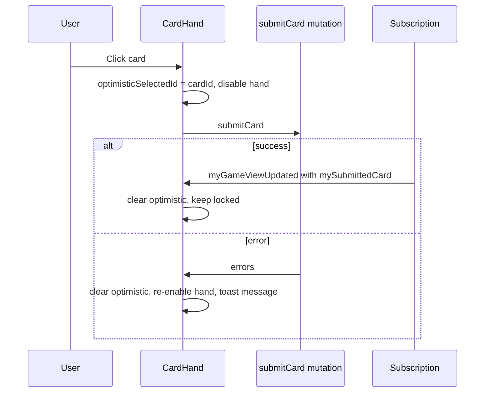

# Frontend Patterns

## Philosophy

- **Subscription as source of truth** for in-game UI — do not duplicate live state in Pinia
- **Optimistic UI** only for `submitCard` (disable hand, show selection until subscription confirms)
- **Minimalist layout** — neutral background, one accent color, card faces as sharp geometric tiles
- **Composition API** — all new components use `<script setup lang="ts">`

## Directory Structure

```
frontend/src/
  main.ts
  App.vue
  router/index.ts
  graphql/
    client.ts
    operations/
      session.graphql
      room.graphql
      game.graphql
    generated/           # codegen output
  composables/
    useGuestSession.ts
    useGameRoom.ts
    useCardSelection.ts
  components/
    layout/
      AppShell.vue
    game/
      CardTile.vue
      CardHand.vue
      GameRow.vue
      GameBoard.vue
      PlayerStrip.vue
      SubmissionProgress.vue
      PhaseIndicator.vue
    lobby/
      RoomCodeInput.vue
      CreateRoomForm.vue
  views/
    HomeView.vue         # Create / join
    LobbyView.vue        # Waiting room
    GameView.vue         # Active play
    ResultsView.vue      # FINISHED overlay or route
  styles/
    main.css             # Tailwind directives + CSS variables
```

## Routing

| Path | View | Auth |
|---|---|---|
| `/` | HomeView | Auto `ensureGuestSession` |
| `/room/:roomId/lobby` | LobbyView | Guest + seated |
| `/room/:roomId/play` | GameView | Guest + seated |
| `/room/:roomId/results` | ResultsView | Guest + FINISHED |

Redirect `/room/:id/play` → `/lobby` if phase is `LOBBY`.

## Composables

### `useGuestSession`

```typescript
// Responsibilities:
// - Load/persist localStorage via @vueuse/core useLocalStorage
// - Call ensureGuestSession on app boot if missing/expired
// - Expose { guestId, sessionToken, isReady, refreshSession }
```

Boot in `App.vue` or router guard before any GraphQL call.

### `useGameRoom(roomId)`

```typescript
// Responsibilities:
// - Subscribe to myGameViewUpdated(roomId)
// - Expose reactive refs: room, myHand, mySubmittedCard, phase, players, rows
// - Methods: submitCard(cardId), leaveRoom()
// - On subscription payload: replace entire view (version check optional)
// - Tear down subscription on unmount
```

**Do not** merge partial subscription patches manually in v1 — full payload replacement is simpler and less bug-prone.

### `useCardSelection`

Local UI state for hover/selected card before submit. Clears when `mySubmittedCard` becomes non-null from server.

## URQL Usage Patterns

| Operation | Method | When |
|---|---|---|
| `ensureGuestSession` | `useQuery` (pause until mounted) | App init |
| `createRoom` / `joinRoom` | `useMutation` | Home / lobby |
| `myGameViewUpdated` | `useSubscription` | Game + lobby screens |
| `submitCard` | `useMutation` | Card click |

### Subscription-first game screen

```vue
<script setup lang="ts">
import { useSubscription } from '@urql/vue';
import { MyGameViewDocument } from '@/graphql/generated';

const props = defineProps<{ roomId: string }>();

const { data, error } = useSubscription({
  query: MyGameViewDocument,
  variables: { roomId: props.roomId },
});

const view = computed(() => data.value?.myGameViewUpdated);
</script>
```

## Optimistic Submit Flow



Never optimistically remove the card from `myHand` — wait for server view to avoid desync on error.

## Component Guidelines

### `CardTile.vue`

Props: `card: Card`, `selected?: boolean`, `disabled?: boolean`, `size?: 'sm' | 'md'`

- Display: large number, small bull-head indicator (minimal icon or dots — not cartoon cows)
- Tailwind: border, subtle shadow, `transition-opacity` on disabled

### `GameBoard.vue`

- Four `GameRow` components in a vertical or 2×2 grid
- Highlight row affected on last resolve (optional animation — keep ≤ 200ms fade)

### `PlayerStrip.vue`

- Name, penalty total, submission status dot
- No hand counts for opponents beyond `cardsInHand` number from public state

## Tailwind Design Tokens

Define in `tailwind.config` or CSS variables:

```css
:root {
  --color-surface: #fafafa;
  --color-card: #ffffff;
  --color-border: #e5e5e5;
  --color-text: #171717;
  --color-muted: #737373;
  --color-accent: #2563eb;   /* Single accent — sparingly */
}
```

Typography: system-ui or Inter. No more than two font sizes for in-game HUD.

## Error & Loading UX

| State | UX |
|---|---|
| Session loading | Full-page minimal spinner or skeleton |
| Subscription disconnected | Banner: "Reconnecting…" + auto-retry via graphql-ws |
| Mutation error | Inline toast with `GameError.message` |
| Wrong phase action | Button disabled proactively using `phase` from view |

## Accessibility

- Card buttons: `aria-pressed` when selected
- Keyboard: number keys 1–N select nth card (nice-to-have)
- Sufficient contrast on Tailwind neutrals

## Testing (When Added)

- Vitest + `@vue/test-utils` for composables and CardTile
- Mock URQL with `@urql/vue` test utilities
- No E2E requirement for portfolio v1

## Cross-References

- Stack choices: [frontend-stack.md](./frontend-stack.md)
- GraphQL operations: [graphql-schema.md](./graphql-schema.md)
- Guest session: [auth.md](./auth.md)
