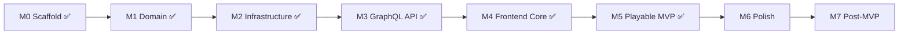

# 6-Nimmt — Implementation Roadmap

Task tracker for moving from **dev scaffold → playable MVP → portfolio polish**. Architecture and rules live in the other `.cursor/` docs — this file is the execution order.

**Last reviewed:** 2026-05-23 (M5 manual QA complete on `cursor/m4-frontend-core`)

---

## Current State

| Area | Status | Notes |
|---|---|---|
| Documentation | ✅ Complete | `.cursor/` aligned with shipped branch behavior |
| Docker Compose | ✅ Complete | Postgres 16, Redis 7, backend, frontend |
| Domain game engine (M1) | ✅ Complete | `backend/app/domain/` — pure rules, `bones` nomenclature; **31 domain tests** |
| Infrastructure layer (M2) | ✅ Complete | Redis sessions, rooms, game loop, pub/sub, timers |
| GraphQL API (M3) | ✅ Complete | Queries, mutations, subscriptions, view builders; **11 GraphQL tests** |
| Backend tests | ✅ Complete | **82 pytest pass** against real Redis (DB 15) |
| Backend entry | ✅ Complete | `main.py` — Redis lifespan, pub/sub listener, full Strawberry schema + WS auth context |
| OpenAPI reference | ✅ Complete | REST health + documented GraphQL contract at `/docs`, `/openapi.yaml` |
| PostgreSQL persistence | ⬜ Not started | `DATABASE_URL` in config; SQLModel/Alembic declared but unused at runtime |
| Frontend core (M4) | ✅ Complete on branch | Router, composables, Home/Lobby/Game views, GraphQL operations, dark theme |
| Frontend build | ✅ Complete | `npm run build` passes with game UI |
| M6 UX (Sprints A–C) | ✅ Largely complete | Select→confirm, countdown, HUD, shortcuts, loading shells, toasts, rules drawer |
| Post-game & rematch | ✅ Complete | Tie-aware `ResultsOverlay`; `returnToLobby` + Rematch / Exit room actions |
| Lobby turn timer | ✅ Complete | Host sets `submitTimeoutSeconds` (3–60s, default 30) before start |
| E2E playable demo (M5) | ✅ Complete | Manual two-browser QA passed (create → join → play → FINISHED, reconnect, rematch) |

**Git:** `cursor/m4-frontend-core` — M4 frontend + M6 UX polish + rematch + configurable turn timer; M5 QA signed off.

**Recent work (branch):** UX audit Sprints A–C; `submitDeadline` exposure; tie-aware results; `returnToLobby` / `updateSubmitTimeout` mutations; display-name persistence; HUD last-resolve row; **M5 portfolio demo verified manually**.

**Next up:** **Merge to `main`**, then **M6 remainder** (a11y audit, optional SFX, score count-up) or **M2.7** Postgres if desired.

### Remaining gaps (post-M4)

| Item | Status | Action |
|---|---|---|
| `is_connected` vs domain `is_active` | Adapter maps `is_active=True`; disconnect only flips `is_connected` | Document v1 behavior; reconcile later |
| `version` optimistic locking | Bumped on save; never checked on read-modify-write | OK for single worker; M7 for multi-worker |
| In-process locks/timers/registry | Process-local only | Single uvicorn worker for MVP |
| `SESSION_SECRET` / Postgres deps | Declared in config/pyproject; unused at runtime | M2.7 or config cleanup |
| CI pipeline | None | M7 backlog |
| OpenAPI spec lag | `openapi.yaml` missing `returnToLobby`, `updateSubmitTimeout`, `submitTimeoutSeconds` | Sync when convenient — GraphQL schema is source of truth |
| pytest-asyncio loop scope | Deprecation warning — set `asyncio_default_fixture_loop_scope` in pyproject | Dev hygiene |

**Completeness note:** **Playable MVP (M5) met.** ~95% toward portfolio-ready demo; remaining work is M6 polish, merge, and optional Postgres/CI.

---

## Milestone Overview



| Milestone | Goal | Status |
|---|---|---|
| **M0** Scaffold | Runnable stack, docs | ✅ Done |
| **M1** Domain engine | Pure rules + unit tests | ✅ Done |
| **M2** Infrastructure | Redis + auth + room state | ✅ Done |
| **M3** GraphQL API | Queries, mutations, subscriptions | ✅ Done |
| **M4** Frontend core | Router, session, lobby, game UI | ✅ Done on branch |
| **M5** Playable MVP | Two browsers, full game loop | ✅ Done (manual QA) |
| **M6** Polish | Design fidelity, motion, a11y, SFX | 🔵 **Current focus** — a11y audit + SFX remain |
| **M7** Post-MVP | Match history, stats, prod profile | ⬜ Backlog |

---

## M0 — Scaffold ✅

- [x] Monorepo layout (`backend/`, `frontend/`, `docker-compose.yml`)
- [x] Backend: FastAPI entry, CORS, config via pydantic-settings
- [x] Backend: Strawberry GraphQL with `health` query
- [x] Frontend: Vue 3 + TypeScript + Vite + Tailwind CSS v4
- [x] Frontend: URQL + graphql-ws client stub (`src/graphql/client.ts`)
- [x] Docker Compose: Postgres, Redis, backend, frontend
- [x] `.env.example` files in backend and frontend
- [x] AI context docs in `.cursor/`

---

## M1 — Domain Game Engine ✅

Pure Python module — **no I/O, no FastAPI imports**. Reference: [game-logic.md](./game-logic.md).

### 1.1 Card & deck primitives

- [x] `backend/app/domain/cards.py` — `Card`, `Deck`, `bones(value) -> int`
- [x] Unit tests: bones for all rule branches (55, ×11, ×10, ×5, default)

### 1.2 Rows & placement helpers

- [x] `backend/app/domain/rows.py` — `Row`, `find_best_row`, `pick_least_bones_row` (Rule C v1 auto-pick)
- [x] Unit tests: normal placement (Rule A), full row collection (Rule B), too-low auto-pick (Rule C + tie-break)

### 1.3 Game state & phases

- [x] `backend/app/domain/game.py` — `GamePhase` enum, `GameState`, deal logic (player count → cards/rounds table)
- [x] Seed four rows with one card each at game start
- [x] `backend/app/domain/scoring.py` — bones totals, winner resolution (ties = shared victory)

### 1.4 Turn resolution

- [x] `backend/app/domain/resolve.py` — `resolve_turn(state, submissions) -> GameState`
- [x] `all_submissions_received()` barrier helper (wired in M2)
- [x] Unit tests: full 2-player mini-game (2 rounds); barrier does not resolve until complete

### 1.5 Test suite baseline

- [x] `pytest` passes on domain tests
- [x] Ruff lint clean on `backend/app/domain/`

---

## M2 — Infrastructure Layer ✅

Reference: [state-management.md](./state-management.md), [auth.md](./auth.md), [database-schema.md](./database-schema.md).

> **Status:** Complete on `main` (M2) + `cursor/m3-graphql-api` (M2.3 GraphQL context, M2.6 subscription wiring). **78 backend tests** pass. PostgreSQL slice (M2.7) deferred to S8.

### 2.1 Redis client & key helpers

- [x] `backend/app/infrastructure/redis.py` — async Redis connection from `REDIS_URL`
- [x] Key helpers: `guest:session:{id}`, `room:{id}`, `room:code:{code}`, pub/sub channel, `guest:{id}:current_room`
- [x] JSON serialize/deserialize for `GameRoomState` (Pydantic model in `models.py`)

### 2.2 Guest session service

- [x] Mint `guestId` (UUID) + opaque `sessionToken`; store SHA-256 hash in Redis
- [x] Session TTL: 7 days sliding; `touch` on authenticated request
- [x] `ensure_guest_session()` service logic + GraphQL `ensureGuestSession` query

### 2.3 Auth middleware / context

- [x] `get_current_guest()` — extract Bearer token + `X-Guest-Id`, validate, fail closed
- [x] GraphQL context injection with `GuestContext` — HTTP headers + WS `connectionParams`

### 2.4 Room lifecycle (Redis)

- [x] Generate 6-char join codes; `room:code:{code}` → `roomId` index
- [x] `create_room` — LOBBY state, host seat, max players default 10
- [x] `join_room` — validate LOBBY, not full, reject mid-game joins
- [x] `leave_room` — LOBBY removal vs mid-game `isConnected = false`
- [x] Host transfer when host leaves in LOBBY
- [x] TTL: 24h on room keys; 2h stale LOBBY cleanup on join attempt

### 2.5 Live game orchestration

- [x] `start_game` — shuffle, deal, seed rows, transition LOBBY → SUBMIT
- [x] `submit_card` — validate phase/hand; per-room asyncio lock
- [x] When all submitted → call `resolve_turn` → update state → publish
- [x] Submission timeout: per-room `submitTimeoutSeconds` (3–60s, default 30); host sets in lobby; auto-play lowest card for missing submissions on deadline
- [x] Reconnect helpers: `reconnect()` / `mark_disconnected()` in infrastructure
- [x] Disconnect grace wired to WebSocket lifecycle (`schedule_disconnect` on subscription teardown)
- [x] Monotonic `version` field on room state (bumped on every save; optimistic check deferred to M7)

### 2.6 Pub/sub fan-out hook

- [x] `PUBLISH room:{roomId}` on every state change with minimal payload
- [x] In-process `PubSubListener` + `SubscriberRegistry`
- [x] Wire subscribers to Strawberry subscription resolvers (`gameRoomUpdated`, `myGameViewUpdated`)

### 2.7 PostgreSQL (minimal — non-blocking)

- [ ] SQLModel models: `Guest`, `Room`, `Match`, `MatchPlayer`
- [ ] Alembic initial migration
- [ ] Async engine setup in `backend/app/infrastructure/db.py`
- [ ] On `FINISHED`: async persist match snapshot (failure must not block results UI)

**M2 done when:** Room create/join/start/submit/resolve works via integration tests against Redis — **met** (`0bbad3e`). GraphQL exposure complete on branch (`41883b1`); PostgreSQL (M2.7) deferred to S8.

---

## M3 — GraphQL API ✅

Reference: [graphql-schema.md](./graphql-schema.md), [openapi.yaml](../backend/openapi.yaml) (contract reference).

Implemented in `backend/app/graphql/` — `schema.py`, `types.py`, `views.py`, `resolvers.py`, `subscriptions.py`, `context.py`, `errors.py`.

### 3.0 API reference (prep)

- [x] OpenAPI spec documents planned schema, auth, and operations (`backend/openapi.yaml`)
- [x] REST `/health` + `/docs` + `/openapi.yaml` endpoints

### 3.1 Schema types

- [x] Enums: `GamePhase`, `GameErrorCode`
- [x] Public types: `Card`, `Row`, `PlayerPublic`, `GameRoomPublic`, `SubmissionProgress`
- [x] Private types: `PlayerPrivateView`, `ResolvedPlay`, `GuestSession`, `MutationResult`, `GameError`
- [x] Populate `last_resolution` during turn resolve (via `apply_game_state`)

### 3.2 Queries

- [x] `health` (exists)
- [x] `ensureGuestSession`
- [x] `roomByCode(code)`
- [x] `myGameView(roomId)` — player-specific view; **no hidden card leakage**

### 3.3 Mutations

- [x] `createRoom`, `joinRoom`, `leaveRoom`, `startGame`, `submitCard`, `updateDisplayName`
- [x] `returnToLobby` — reset `FINISHED` room to `LOBBY` for rematch (any seated player)
- [x] `updateSubmitTimeout` — host-only, `LOBBY` only; 3–60 seconds per round
- [x] Typed error payloads (`success: false` + `GameErrorCode`); no exceptions for rule violations
- [x] Return refreshed `view` on success

### 3.4 Subscriptions

- [x] `gameRoomUpdated(roomId)` — public payload
- [x] `myGameViewUpdated(roomId)` — **per-connection** private view (never broadcast shared private payload)
- [x] WebSocket auth via `connectionParams.authorization` (+ optional `guestId`)
- [x] WS protocols: `graphql-transport-ws` and `graphql-ws`
- [x] Subscribe to Redis pub/sub via `SubscriberRegistry`; rebuild view on `STATE_UPDATED`
- [x] `reconnect()` on subscribe; `schedule_disconnect()` on subscription teardown

### 3.5 Visibility & security audit

- [x] Verify: other players' chosen cards never appear pre-resolve
- [x] Verify: `myHand` only in `PlayerPrivateView`
- [x] HTTP 401 for unauthenticated mutations/queries (via `GraphQLContext.require_guest`)
- [x] `GAME_ALREADY_STARTED` error mapping for late join attempts

### 3.6 API tests

- [x] httpx async tests: session → create room → join → start → submit → finish (`test_full_two_player_game_via_graphql`)
- [x] Two-guest scenario: submission barrier + resolve via GraphQL transport
- [x] Subscription tests: `myGameViewUpdated` emits resolve payload with `lastResolvedPlays`
- [x] Card-leak audit: `test_no_hand_leakage_in_public_room`

**M3 done when:** GraphQL playground can run a full 2-player game with subscriptions — **met** (`41883b1`).

---

## M4 — Frontend Core ✅

Reference: [frontend-patterns.md](./frontend-patterns.md), [frontend-design.md](./frontend-design.md), [frontend-stack.md](./frontend-stack.md).

Implemented on `cursor/m4-frontend-core` (`00be70c` + handoff fixes).

### 4.1 Tooling & plumbing

- [x] Vue Router — `router/index.ts` with routes: `/`, `/room/:roomId/lobby`, `/room/:roomId/play`, `/room/:roomId/results`
- [x] `@fontsource/inter` + dark theme CSS variables from frontend-design.md
- [x] `lucide-vue-next` icons
- [x] GraphQL operations in `src/graphql/operations.ts` (hand-written; codegen deferred)
- [x] URQL client reads/writes `6nimmt_guest` localStorage key (`src/lib/guest-session.ts`)

### 4.2 Composables

- [x] `useGuestSession` — boot `ensureGuestSession`, persist session, attach auth headers
- [x] `useGameRoom(roomId)` — `myGameViewUpdated` subscription as source of truth
- [x] `useCardSelection` — select + submit with optimistic lock

### 4.3 Layout & feedback

- [x] `AppShell.vue`, `MobileDesktopNotice.vue`, `SfxToggle.vue`
- [x] `ToastHost.vue`, `ReconnectBanner.vue`, `ConfirmDialog.vue`
- [x] `RulesDrawer.vue` — collapsible "How to play" + Rule C note

### 4.4 Home & lobby

- [x] `HomeView` — name field, create room, 6-char code input with auto-advance
- [x] `LobbyView` — player list, host badge, copy code/link, **turn-timer slider (host)**, start game (host, ≥2 players)
- [x] Phase-driven navigation: LOBBY → lobby route; SUBMIT+ → play route
- [x] Lobby rename updates seated player in room (`update_seated_display_name` + mutation view)

### 4.5 Game shell (minimal first)

- [x] `GameView` — subscribe to `myGameViewUpdated`
- [x] `PhaseIndicator`, `SubmissionProgress`, `PlayerStrip`
- [x] `GameBoard` + `GameRow` + `CardTile` (hue bands + bone indicators)
- [x] `CardHand` — single-click submit, optimistic lock, submitted card pinned separately
- [x] `GamePhaseOverlay` for DEAL / RESOLVE / SCORE
- [x] `ResolveFeed` — stagger `lastResolvedPlays`
- [x] `ResultsOverlay` on FINISHED — tie-aware ranks, **Rematch** (primary) + **Exit room** (secondary)

**M4 done when:** UI renders live state from backend subscriptions; host can start and players can submit cards — **met** on branch.

---

## M5 — Playable MVP ✅

Portfolio demo checklist from [deployment.md](./deployment.md). **Verified manually** on `cursor/m4-frontend-core` (2026-05-23).

- [x] `docker compose up --build` starts full stack
- [x] Two browser windows: create room → join with code → play full game to FINISHED
- [x] Simultaneous submit barrier works (3+ players if tested)
- [x] Disconnect/reconnect preserves seat and submission
- [x] Rule C / timeout feedback in UI (deadline overlay + `RulesDrawer`; dedicated Rule C toast deferred — acceptable for MVP)
- [x] No hidden-card leaks in browser (manual DevTools check; backend audit automated)
- [x] Backend tests pass (`pytest` — 82 tests)
- [x] Backend card-leak audit automated (`test_no_hand_leakage_in_public_room`)
- [x] Frontend build passes (`npm run build`)

**M5 done when:** A complete 2-player game finishes with correct scores and results overlay — **met**.

---

## M6 — Polish & Showcase Quality

Reference: [frontend-design.md](./frontend-design.md), **[ux-audit.md](./ux-audit.md)** (Nielsen heuristic backlog).

### 6.1 Visual fidelity

- [x] Dark theme tokens applied consistently
- [x] Card gradients per value band; bone dot/ring indicators
- [x] Felt surface behind board; amber accent on CTAs

### 6.2 Motion & feedback

- [x] Hover lift, submit lock fade, player-strip submit highlight, row highlight
- [x] `prefers-reduced-motion` fallbacks for core animations
- [ ] Score count-up on results (400ms planned; static today)
- [x] Winner / tie gold border + trophy on results rows

### 6.3 UX heuristics (Sprint A — see ux-audit.md)

- [x] Expose `submitDeadline` in GraphQL + `SubmitCountdown.vue`
- [x] Select → confirm card flow; auto-submit selection on deadline
- [x] Submit-pending indicator + mutation timeout/retry toasts
- [x] `PlayerStrip` submission highlights; remove `SubmissionProgress` bar
- [x] Error toasts with expandable “More details”

### 6.4 UX heuristics (Sprint B)

- [x] Keyboard shortcuts (`Esc`, `Enter`, `1`–`N`) via `useGameShortcuts`
- [x] Icon-only SFX + Leave (`IconButton.vue`)
- [x] `LoadingShell.vue` for Home / Lobby / Game boot
- [x] Timeout auto-play feedback overlay for affected player
- [x] Visual `RulesDrawer` with `CardTile` examples

### 6.5 Accessibility

- [x] Keyboard: Tab + number keys + Enter confirm + Esc cancel/leave
- [ ] `aria-pressed` / `aria-disabled` on cards
- [ ] Toast `role="status"` / `role="alert"` (partial — `ConnectionStatusBanner` uses `role="status"`)
- [ ] WCAG AA contrast audit on card faces

### 6.6 Optional SFX

- [ ] Web Audio API triggers; `sfxEnabled` in localStorage; muted by default
- [ ] Assets in `frontend/public/sfx/`

### 6.7 Developer experience

- [ ] README quick-start verified on clean machine
- [ ] Match row visible in Postgres after game (`psql` spot-check)

---

## M7 — Post-MVP Backlog

Not required for portfolio demo. Track here; implement when M5–M6 are stable.

| Task | Doc reference |
|---|---|
| Match history query (`recentMatches`) | [database-schema.md](./database-schema.md) |
| Guest stats / leaderboard | [database-schema.md](./database-schema.md) |
| Manual Rule C row choice (timed UI) | [game-logic.md](./game-logic.md) |
| Spectator mode for finished games | [graphql-schema.md](./graphql-schema.md) |
| Rate limiting middleware | [auth.md](./auth.md) |
| `docker-compose.prod.yml` — nginx static frontend | [deployment.md](./deployment.md) |
| DataLoaders for history pages | [graphql-schema.md](./graphql-schema.md) |
| GraphQL codegen (`graphql-codegen`) | [frontend-patterns.md](./frontend-patterns.md) |
| CI: pytest + ruff + `vue-tsc` + build | — |
| Multi-worker Redis lock hardening | [state-management.md](./state-management.md) |

---

## Suggested Sprint Order

| Sprint | Focus | Status | Deliverable |
|---|---|---|---|
| **S1** | M1 complete | ✅ Done | `pytest` green on domain |
| **S2** | M2.1–2.4 | ✅ Done | Guest session + room create/join in Redis |
| **S3** | M2.5–2.6 | ✅ Done | Full game loop in Redis + pub/sub |
| **S4** | M3 | ✅ Done | GraphQL API + subscription demo in playground |
| **S5** | M4.1–4.5 | ✅ Done on branch | Router, session, Home/Lobby/Game wired to GraphQL |
| **S6** | M5 QA + fixes | ✅ Done | Two-browser MVP verified manually |
| **S7** | M6 remainder | 🔵 **In progress** | a11y audit, optional SFX, score count-up |
| **S8** | M2.7 + M7 picks | ⬜ Pending | Postgres persistence + extras |

**Immediate actions:**

1. Merge `cursor/m4-frontend-core` to `main`.
2. M6 remainder: a11y audit (`aria-*`, toast roles, contrast), optional SFX, results score count-up.
3. Optional: sync `openapi.yaml` with rematch / turn-timer fields.

---

## Task Dependencies (Critical Path)

```
domain (M1) ✅
  └─► redis room orchestration (M2) ✅
        └─► graphql resolvers (M3) ✅
              └─► frontend composables + views (M4) ✅
                    └─► MVP demo (M5) ✅
                          └─► polish (M6) ← YOU ARE HERE
```

**Parallelizable now:**

- PostgreSQL models + Alembic (M2.7) — independent until `FINISHED` hook
- Frontend static components (CardTile, AppShell) — can build with mock props while wiring composables

---

## How to Use This File

1. Pick the **first unchecked** task on the critical path (M6 polish or merge + M2.7).
2. Read the linked doc section before coding.
3. Check boxes when merged; update **Current State** table at the top.
4. If architecture changes, update the relevant `.cursor/*.md` doc **before** checking off dependent tasks.

---

## Cross-References

| Need | Doc |
|---|---|
| Known gaps & MVP blockers | [architecture-overview.md](./architecture-overview.md#known-gaps--mvp-blockers) |
| System boundaries & data flow | [architecture-overview.md](./architecture-overview.md) |
| Game rules & edge cases | [game-logic.md](./game-logic.md) |
| API contract | [graphql-schema.md](./graphql-schema.md) |
| OpenAPI reference (implemented) | [openapi.yaml](../backend/openapi.yaml) |
| Redis keys & pub/sub | [state-management.md](./state-management.md) |
| Guest tokens | [auth.md](./auth.md) |
| Postgres tables | [database-schema.md](./database-schema.md) |
| Local run & demo | [deployment.md](./deployment.md) |
| UI screens & motion | [frontend-design.md](./frontend-design.md) |
| UX heuristic backlog | [ux-audit.md](./ux-audit.md) |
| Vue conventions | [frontend-patterns.md](./frontend-patterns.md) |
| Doc index | [README.md](./README.md) |
