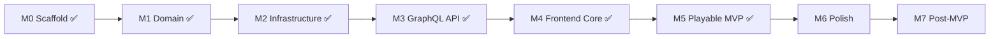

# BARE BONES — Implementation Roadmap

Task tracker for moving from **dev scaffold → playable MVP → portfolio polish**. Architecture and rules live in the other `.cursor/` docs — this file is the execution order.

**Last reviewed:** 2026-05-26 (M6 visual overhaul — Balatro/Wii direction)

---

## Current State


| Area                          | Status               | Notes                                                                                  |
| ----------------------------- | -------------------- | -------------------------------------------------------------------------------------- |
| Documentation                 | ✅ Complete           | `.cursor/` aligned with shipped branch behavior                                        |
| Docker Compose                | ✅ Complete           | Postgres 16, Redis 7, backend, frontend                                                |
| Domain game engine (M1)       | ✅ Complete           | `backend/app/domain/` — pure rules, `bones` nomenclature; **31 domain tests**          |
| Infrastructure layer (M2)     | ✅ Complete           | Redis sessions, rooms, game loop, pub/sub, timers                                      |
| GraphQL API (M3)              | ✅ Complete           | Queries, mutations, subscriptions, view builders; **11 GraphQL tests**                 |
| Backend tests                 | ✅ Complete           | **82 pytest pass** against real Redis (DB 15)                                          |
| Backend entry                 | ✅ Complete           | `main.py` — Redis lifespan, pub/sub listener, full Strawberry schema + WS auth context |
| OpenAPI reference             | ✅ Complete           | REST health + documented GraphQL contract at `/docs`, `/openapi.yaml`                  |
| PostgreSQL persistence        | ⬜ Not started        | `DATABASE_URL` in config; SQLModel/Alembic declared but unused at runtime              |
| Frontend core (M4)            | ✅ Complete on branch | Router, composables, Home/Lobby/Game views, GraphQL operations, dark theme             |
| Frontend build                | ✅ Complete           | `npm run build` passes with game UI                                                    |
| M6 UX (Sprints A–C)           | ✅ Complete           | Select→confirm, countdown, HUD, shortcuts, loading shells, toasts, rules drawer        |
| M6 Visual overhaul (3D scene) | 🔵 In progress       | TresJS + light Wii tokens + CRT filter; 6.5 hover/select lift shipped |
| Post-game & rematch           | ✅ Complete           | Tie-aware `ResultsOverlay`; `returnToLobby` + Rematch / Exit room actions              |
| Lobby turn timer              | ✅ Complete           | Host sets `submitTimeoutSeconds` (3–60s, default 30) before start                      |
| E2E playable demo (M5)        | ✅ Complete           | Manual two-browser QA passed (create → join → play → FINISHED, reconnect, rematch)     |


**Git:** `cursor/m4-frontend-core` — M4 frontend + M6 UX polish + rematch + configurable turn timer; M5 QA signed off.

**Recent work (branch):** UX audit Sprints A–C; `submitDeadline` exposure; tie-aware results; `returnToLobby` / `updateSubmitTimeout` mutations; display-name persistence; HUD last-resolve row; **M5 portfolio demo verified manually**.

**Next up:** **M6.1** (scene shell + table) — first deliverable in the visual overhaul track below. Merge to `main` can happen in parallel once a scene slice is stable.

### Remaining gaps (post-M4)


| Item                                 | Status                                                                                | Action                                                   |
| ------------------------------------ | ------------------------------------------------------------------------------------- | -------------------------------------------------------- |
| `is_connected` vs domain `is_active` | Adapter maps `is_active=True`; disconnect only flips `is_connected`                   | Document v1 behavior; reconcile later                    |
| `version` optimistic locking         | Bumped on save; never checked on read-modify-write                                    | OK for single worker; M7 for multi-worker                |
| In-process locks/timers/registry     | Process-local only                                                                    | Single uvicorn worker for MVP                            |
| `SESSION_SECRET` / Postgres deps     | Declared in config/pyproject; unused at runtime                                       | M2.7 or config cleanup                                   |
| CI pipeline                          | None                                                                                  | M7 backlog                                               |
| OpenAPI spec lag                     | `openapi.yaml` missing `returnToLobby`, `updateSubmitTimeout`, `submitTimeoutSeconds` | Sync when convenient — GraphQL schema is source of truth |
| pytest-asyncio loop scope            | Deprecation warning — set `asyncio_default_fixture_loop_scope` in pyproject           | Dev hygiene                                              |


**Completeness note:** **Playable MVP (M5) met.** ~95% toward portfolio-ready demo; remaining work is M6 polish, merge, and optional Postgres/CI.

---

## Milestone Overview




| Milestone             | Goal                                      | Status                                                  |
| --------------------- | ----------------------------------------- | ------------------------------------------------------- |
| **M0** Scaffold       | Runnable stack, docs                      | ✅ Done                                                  |
| **M1** Domain engine  | Pure rules + unit tests                   | ✅ Done                                                  |
| **M2** Infrastructure | Redis + auth + room state                 | ✅ Done                                                  |
| **M3** GraphQL API    | Queries, mutations, subscriptions         | ✅ Done                                                  |
| **M4** Frontend core  | Router, session, lobby, game UI           | ✅ Done on branch                                        |
| **M5** Playable MVP   | Two browsers, full game loop              | ✅ Done (manual QA)                                      |
| **M6** Polish         | Wii/Balatro 3D scene, motion, 2P showcase | 🔵 **Current focus** — visual overhaul track (6.1–6.12) |
| **M7** Post-MVP       | Match history, stats, prod profile        | ⬜ Backlog                                               |


---

## M0 — Scaffold ✅

- Monorepo layout (`backend/`, `frontend/`, `docker-compose.yml`)
- Backend: FastAPI entry, CORS, config via pydantic-settings
- Backend: Strawberry GraphQL with `health` query
- Frontend: Vue 3 + TypeScript + Vite + Tailwind CSS v4
- Frontend: URQL + graphql-ws client stub (`src/graphql/client.ts`)
- Docker Compose: Postgres, Redis, backend, frontend
- `.env.example` files in backend and frontend
- AI context docs in `.cursor/`

---

## M1 — Domain Game Engine ✅

Pure Python module — **no I/O, no FastAPI imports**. Reference: [game-logic.md](./game-logic.md).

### 1.1 Card & deck primitives

- `backend/app/domain/cards.py` — `Card`, `Deck`, `bones(value) -> int`
- Unit tests: bones for all rule branches (55, ×11, ×10, ×5, default)

### 1.2 Rows & placement helpers

- `backend/app/domain/rows.py` — `Row`, `find_best_row`, `pick_least_bones_row` (Rule C v1 auto-pick)
- Unit tests: normal placement (Rule A), full row collection (Rule B), too-low auto-pick (Rule C + tie-break)

### 1.3 Game state & phases

- `backend/app/domain/game.py` — `GamePhase` enum, `GameState`, deal logic (player count → cards/rounds table)
- Seed four rows with one card each at game start
- `backend/app/domain/scoring.py` — bones totals, winner resolution (ties = shared victory)

### 1.4 Turn resolution

- `backend/app/domain/resolve.py` — `resolve_turn(state, submissions) -> GameState`
- `all_submissions_received()` barrier helper (wired in M2)
- Unit tests: full 2-player mini-game (2 rounds); barrier does not resolve until complete

### 1.5 Test suite baseline

- `pytest` passes on domain tests
- Ruff lint clean on `backend/app/domain/`

---

## M2 — Infrastructure Layer ✅

Reference: [state-management.md](./state-management.md), [auth.md](./auth.md), [database-schema.md](./database-schema.md).

> **Status:** Complete on `main` (M2) + `cursor/m3-graphql-api` (M2.3 GraphQL context, M2.6 subscription wiring). **78 backend tests** pass. PostgreSQL slice (M2.7) deferred to S8.

### 2.1 Redis client & key helpers

- `backend/app/infrastructure/redis.py` — async Redis connection from `REDIS_URL`
- Key helpers: `guest:session:{id}`, `room:{id}`, `room:code:{code}`, pub/sub channel, `guest:{id}:current_room`
- JSON serialize/deserialize for `GameRoomState` (Pydantic model in `models.py`)

### 2.2 Guest session service

- Mint `guestId` (UUID) + opaque `sessionToken`; store SHA-256 hash in Redis
- Session TTL: 7 days sliding; `touch` on authenticated request
- `ensure_guest_session()` service logic + GraphQL `ensureGuestSession` query

### 2.3 Auth middleware / context

- `get_current_guest()` — extract Bearer token + `X-Guest-Id`, validate, fail closed
- GraphQL context injection with `GuestContext` — HTTP headers + WS `connectionParams`

### 2.4 Room lifecycle (Redis)

- Generate 6-char join codes; `room:code:{code}` → `roomId` index
- `create_room` — LOBBY state, host seat, max players default 10
- `join_room` — validate LOBBY, not full, reject mid-game joins
- `leave_room` — LOBBY removal vs mid-game `isConnected = false`
- Host transfer when host leaves in LOBBY
- TTL: 24h on room keys; 2h stale LOBBY cleanup on join attempt

### 2.5 Live game orchestration

- `start_game` — shuffle, deal, seed rows, transition LOBBY → SUBMIT
- `submit_card` — validate phase/hand; per-room asyncio lock
- When all submitted → call `resolve_turn` → update state → publish
- Submission timeout: per-room `submitTimeoutSeconds` (3–60s, default 30); host sets in lobby; auto-play lowest card for missing submissions on deadline
- Reconnect helpers: `reconnect()` / `mark_disconnected()` in infrastructure
- Disconnect grace wired to WebSocket lifecycle (`schedule_disconnect` on subscription teardown)
- Monotonic `version` field on room state (bumped on every save; optimistic check deferred to M7)

### 2.6 Pub/sub fan-out hook

- `PUBLISH room:{roomId}` on every state change with minimal payload
- In-process `PubSubListener` + `SubscriberRegistry`
- Wire subscribers to Strawberry subscription resolvers (`gameRoomUpdated`, `myGameViewUpdated`)

### 2.7 PostgreSQL (minimal — non-blocking)

- SQLModel models: `Guest`, `Room`, `Match`, `MatchPlayer`
- Alembic initial migration
- Async engine setup in `backend/app/infrastructure/db.py`
- On `FINISHED`: async persist match snapshot (failure must not block results UI)

**M2 done when:** Room create/join/start/submit/resolve works via integration tests against Redis — **met** (`0bbad3e`). GraphQL exposure complete on branch (`41883b1`); PostgreSQL (M2.7) deferred to S8.

---

## M3 — GraphQL API ✅

Reference: [graphql-schema.md](./graphql-schema.md), [openapi.yaml](../backend/openapi.yaml) (contract reference).

Implemented in `backend/app/graphql/` — `schema.py`, `types.py`, `views.py`, `resolvers.py`, `subscriptions.py`, `context.py`, `errors.py`.

### 3.0 API reference (prep)

- OpenAPI spec documents planned schema, auth, and operations (`backend/openapi.yaml`)
- REST `/health` + `/docs` + `/openapi.yaml` endpoints

### 3.1 Schema types

- Enums: `GamePhase`, `GameErrorCode`
- Public types: `Card`, `Row`, `PlayerPublic`, `GameRoomPublic`, `SubmissionProgress`
- Private types: `PlayerPrivateView`, `ResolvedPlay`, `GuestSession`, `MutationResult`, `GameError`
- Populate `last_resolution` during turn resolve (via `apply_game_state`)

### 3.2 Queries

- `health` (exists)
- `ensureGuestSession`
- `roomByCode(code)`
- `myGameView(roomId)` — player-specific view; **no hidden card leakage**

### 3.3 Mutations

- `createRoom`, `joinRoom`, `leaveRoom`, `startGame`, `submitCard`, `updateDisplayName`
- `returnToLobby` — reset `FINISHED` room to `LOBBY` for rematch (any seated player)
- `updateSubmitTimeout` — host-only, `LOBBY` only; 3–60 seconds per round
- Typed error payloads (`success: false` + `GameErrorCode`); no exceptions for rule violations
- Return refreshed `view` on success

### 3.4 Subscriptions

- `gameRoomUpdated(roomId)` — public payload
- `myGameViewUpdated(roomId)` — **per-connection** private view (never broadcast shared private payload)
- WebSocket auth via `connectionParams.authorization` (+ optional `guestId`)
- WS protocols: `graphql-transport-ws` and `graphql-ws`
- Subscribe to Redis pub/sub via `SubscriberRegistry`; rebuild view on `STATE_UPDATED`
- `reconnect()` on subscribe; `schedule_disconnect()` on subscription teardown

### 3.5 Visibility & security audit

- Verify: other players' chosen cards never appear pre-resolve
- Verify: `myHand` only in `PlayerPrivateView`
- HTTP 401 for unauthenticated mutations/queries (via `GraphQLContext.require_guest`)
- `GAME_ALREADY_STARTED` error mapping for late join attempts

### 3.6 API tests

- httpx async tests: session → create room → join → start → submit → finish (`test_full_two_player_game_via_graphql`)
- Two-guest scenario: submission barrier + resolve via GraphQL transport
- Subscription tests: `myGameViewUpdated` emits resolve payload with `lastResolvedPlays`
- Card-leak audit: `test_no_hand_leakage_in_public_room`

**M3 done when:** GraphQL playground can run a full 2-player game with subscriptions — **met** (`41883b1`).

---

## M4 — Frontend Core ✅

Reference: [frontend-patterns.md](./frontend-patterns.md), [frontend-design.md](./frontend-design.md), [frontend-stack.md](./frontend-stack.md).

Implemented on `cursor/m4-frontend-core` (`00be70c` + handoff fixes).

### 4.1 Tooling & plumbing

- Vue Router — `router/index.ts` with routes: `/`, `/room/:roomId/lobby`, `/room/:roomId/play`, `/room/:roomId/results`
- `@fontsource/inter` + dark theme CSS variables from frontend-design.md
- `lucide-vue-next` icons
- GraphQL operations in `src/graphql/operations.ts` (hand-written; codegen deferred)
- URQL client reads/writes `6nimmt_guest` localStorage key (`src/lib/guest-session.ts`)

### 4.2 Composables

- `useGuestSession` — boot `ensureGuestSession`, persist session, attach auth headers
- `useGameRoom(roomId)` — `myGameViewUpdated` subscription as source of truth
- `useCardSelection` — select + submit with optimistic lock

### 4.3 Layout & feedback

- `AppShell.vue`, `MobileDesktopNotice.vue`, `SfxToggle.vue`
- `ToastHost.vue`, `ReconnectBanner.vue`, `ConfirmDialog.vue`
- `RulesDrawer.vue` — collapsible "How to play" + Rule C note

### 4.4 Home & lobby

- `HomeView` — name field, create room, 6-char code input with auto-advance
- `LobbyView` — player list, host badge, copy code/link, **turn-timer slider (host)**, start game (host, ≥2 players)
- Phase-driven navigation: LOBBY → lobby route; SUBMIT+ → play route
- Lobby rename updates seated player in room (`update_seated_display_name` + mutation view)

### 4.5 Game shell (minimal first)

- `GameView` — subscribe to `myGameViewUpdated`
- `PhaseIndicator`, `SubmissionProgress`, `PlayerStrip`
- `GameBoard` + `GameRow` + `CardTile` (hue bands + bone indicators)
- `CardHand` — single-click submit, optimistic lock, submitted card pinned separately
- `GamePhaseOverlay` for DEAL / RESOLVE / SCORE
- `ResolveFeed` — stagger `lastResolvedPlays`
- `ResultsOverlay` on FINISHED — tie-aware ranks, **Rematch** (primary) + **Exit room** (secondary)

**M4 done when:** UI renders live state from backend subscriptions; host can start and players can submit cards — **met** on branch.

---

## M5 — Playable MVP ✅

Portfolio demo checklist from [deployment.md](./deployment.md). **Verified manually** on `cursor/m4-frontend-core` (2026-05-23).

- `docker compose up --build` starts full stack
- Two browser windows: create room → join with code → play full game to FINISHED
- Simultaneous submit barrier works (3+ players if tested)
- Disconnect/reconnect preserves seat and submission
- Rule C / timeout feedback in UI (deadline overlay + `RulesDrawer`; dedicated Rule C toast deferred — acceptable for MVP)
- No hidden-card leaks in browser (manual DevTools check; backend audit automated)
- Backend tests pass (`pytest` — 82 tests)
- Backend card-leak audit automated (`test_no_hand_leakage_in_public_room`)
- Frontend build passes (`npm run build`)

**M5 done when:** A complete 2-player game finishes with correct scores and results overlay — **met**.

---

## M6 — Polish & Showcase Quality

**Creative direction (locked for this track):** Wii / Xbox 360 console vibes — **light-first**, off-white surfaces, subtle CRT scanlines + low-res feel. In-game: **TresJS/Three.js** table with tilted camera, flat 3D cards, fan hand, step-by-step animated resolve (Balatro clarity). **2 players max** for showcase scope. SFX deferred.

Reference: [frontend-design.md](./frontend-design.md) (needs token refresh), **[ux-audit.md](./ux-audit.md)** (Nielsen backlog — UX sprints shipped).

> **How to work this section:** Pick the **first unchecked** task in **6.1 → 6.12**. Each task is one reviewable PR/slice. Do not skip ahead on animation orchestration (6.8) until staging zones (6.6) land.

---

### Shipped baseline (M6 UX — keep; do not regress)

- Select → confirm flow, `SubmitCountdown`, submit-pending + retry toasts
- Keyboard shortcuts (`Esc`, `Enter`, `1`–`N`) via `useGameShortcuts`
- `LoadingShell`, `RulesDrawer`, `GamePhaseOverlay`, tie-aware `ResultsOverlay`
- `PlayerStrip` submission highlights; `ConnectionStatusBanner`
- 2D motion fallbacks: hover lift, row highlight, `prefers-reduced-motion`
- Winner / tie gold border + trophy on results rows

---

### 6.0 — Foundation & scope *(complete)*

**Deliverable:** App boots with light tokens, CRT overlay, TresJS registered, game view mounts an empty scene canvas.

- Install `@tresjs/core`, `@tresjs/cientos`, `three`, `@tweenjs/tween.js`; wire Vite compiler + `main.ts`
- Light Wii tokens in `style.css` (`--color-surface` off-white, cyan accent)
- CRT scanline overlays (`.crt-game` viewport + global `#app::before`)
- `GameView` mounts `<GameScene />` inside `.crt-game` wrapper
- **2-player cap** — lobby UI + host start guard (`maxPlayers = 2`); copy updates (“duel”, not “table of 10”)
- **Design doc sync** — update `frontend-design.md` locked decisions (light-first, 3D board, 2P scope)

**Review checkpoint:** Two browsers can create/join/start; scene canvas renders (even if empty); lobby rejects a 3rd player.

---

### 6.1 — Scene shell & camera *(complete)*

**Deliverable:** Static white infinite table, tilted perspective, clean lighting — no cards yet.

- `GameScene.vue` — TresCanvas, resize-safe aspect ratio inside `.crt-game`
- `TableSurface.vue` — large off-white plane, soft shadow, slight gloss; feels “Wii white” not flat `#fff`
- Camera rig — ~25–35° pitch, centered on row area; subtle ambient + directional light
- `scene/constants.ts` — world units, card dimensions, table bounds (single source of truth)

**Review checkpoint:** Empty table reads as a physical surface; no z-fighting; 60fps on laptop iGPU.

---

### 6.2 — Card mesh primitive *(complete — dependency for 6.3)*

**Deliverable:** One reusable 3D card with black back; face shows value + bone tier from existing chroma rules.

- `CardMesh.vue` — thin box mesh, rounded feel via bevel or canvas texture padding
- Black back material (placeholder until art pass)
- `cardAppearance.ts` — map `value` + `bones` → face color/gradient texture (reuse hue bands from `CardTile`)
- Face readable at table distance (large numeral, minimal bone marker)

**Review checkpoint:** Drop a debug card in scene; rotate to verify back; values 1 / 55 / 104 look distinct.

---

### 6.3 — Row track (static board) *(complete)*

**Deliverable:** Four row lanes on the table; seed cards from `rows` subscription lie flat, slightly embedded in felt zone.

- `RowTrack.vue` — four parallel lanes, subtle lane guides (etched lines or shallow grooves)
- Row cards laid **face-up, flat** on table (not standing)
- Row highlight hook — amber wash when `highlightedRowIndex` set (from `lastResolvedPlays`)
- Replace or hide legacy `GameBoard.vue` in play view once rows render in 3D

**Review checkpoint:** Mid-game subscription snapshot matches 2D board card order; highlight visible on last resolved row.

---

### 6.4 — Hand fan layout

**Deliverable:** Your hand renders as an IRL-style fan along the near edge of the table.

- `fanLayout.ts` — arc positions + yaw per index (symmetric fan, sorted ascending)
- `HandFan.vue` — renders `myHand` cards; faces toward camera
- Hand locked state — desaturate / lower opacity when `handDisabled` or post-submit
- Wire `@select` from raycast or invisible hit targets (keep keyboard path in 6.11)

**Review checkpoint:** 10-card hand fans without overlap clipping; select state syncs with `selectedCardId`.

---

### 6.4R — Visual composition refactor *(complete)*

**Goal:** Seamless canvas, shadow-only playfield, left-anchored tracks, gentler camera, larger pieces, Balatro-style flat hand. Refactor layout constants first; do **not** start 6.5 lift/tweens until this slice is signed off.

**Deliverable:** Scene reads as one surface with the page; play area defined only by a soft shadow; rows readable at top-left; hand matches Balatro reference (parallel, overlapping, organic Y jitter, zero yaw).

#### R1 — Seamless canvas chrome
- [x] Match `SCENE.clearColor` to `--color-surface` (`#f2f0eb`) — no visible canvas “frame”
- [x] Remove `rounded-xl` / border affordances on `TresCanvas` and `.scene-canvas`
- [x] Increase viewport in `GameView`: taller scene slot (~`65vh` / ~640px min)
- [x] Keep CRT scanlines on `.crt-game` only; verify they don’t read as a boxed panel

#### R2 — Shadow-only playfield (replace gray table)
- [x] Remove visible table planes in `TableSurface.vue` (both `surfaceColor` + `edgeColor` meshes)
- [x] Introduce `PLAYFIELD` bounds in `constants.ts` — **larger** than current `ROW_AREA`; shadow defines table edge
- [x] Single soft demarcation: retune `ContactShadows` (or lightweight shadow mesh) — warm gray, low opacity, no fill plane
- [x] Page background shows through center; shadow silhouette = playable bounds

#### R3 — Camera & scale pass
- [x] Reduce pitch: `CAMERA.pitchDeg` ~30 → **22–24°** (far rows less foreshortened / pixelated)
- [x] Bump world scale ~**1.25–1.35×** on `CARD.*`, row spacing, playfield size
- [x] Retarget camera at left-weighted playfield (not global origin center)
- [x] Raise face texture resolution in `cardAppearance.ts` (256×360 → **512×720**) for row cards at distance

#### R4 — Left-anchored row tracks
- [x] `rowLayout.ts`: rows start from **left edge** of `PLAYFIELD` + padding (not X-centered)
- [x] Remove gray felt zone + heavy lane groove meshes in `RowTrack.vue` (keep subtle dividers or none)
- [x] Row highlight wash unchanged; align to new lane positions
- [x] Card order still matches subscription `row.cards` left → right

#### R5 — Balatro hand disposition
- [x] Replace arc/`yaw` fan in `fanLayout.ts` with **horizontal strip**:
  - All cards `rotation: [0, 0, 0]` — flat facing player
  - ~**35–45% horizontal overlap** (sorted ascending)
  - Deterministic **Y jitter** per card (hash/id-based, ±small world units) — organic, stable across frames
  - Optional tiny Z stagger for depth sort
- [x] `HandFan.vue` / `CardMesh`: no yaw on hand orientation
- [x] Keyboard `1–N` still follows ascending visual order

**Review checkpoint:** Screenshot compare — canvas blends with page; no gray table; shadow bounds obvious; row 1 cards legible; hand looks like Balatro strip (parallel, overlapping, slightly uneven baseline).

**Files (expected touch):** `constants.ts`, `rowLayout.ts`, `fanLayout.ts`, `TableSurface.vue` (or rename `PlayfieldShadow.vue`), `RowTrack.vue`, `GameScene.vue`, `GameView.vue`, `style.css`, `cardAppearance.ts`.

---

### 6.5 — Hover & select lift *(complete)*

**Deliverable:** Balatro-style tactile hand — hover rises slightly; selected rises higher + accent edge.

- [x] `useCardLift.ts` — normalized lift tiers: rest → hover (+Y, +Z) → selected (+more Y, scale 1.02)
- [x] Tween transitions (~150ms hover, ~120ms select) via `@tweenjs/tween.js`
- [x] `prefers-reduced-motion` — snap to target transforms, keep color/ring cues
- [x] Selected card visually distinct from hover (ring / emissive rim — cyan accent)

**Review checkpoint:** Mouse + keyboard selection both trigger lift; only one card at selected tier.

---

### 6.6 — Submit staging zones *(complete — lite)*

**Deliverable:** On confirm, card animates from fan to a **table corner staging slot** (face-up, flat), waiting for opponent.

- [x] Staging anchors — **your corner** (near-right) vs **opponent corner** (far-left / deep)
- [x] Submit animation — arc path, ~400ms, ease-out; hand slot collapses fan gap
- [x] Opponent staging — when `hasSubmitted`, show **card back** sliding from far edge
- [x] Opponent hand hidden — only staging slot + row track (never rendered)

**Review checkpoint:** 2-browser test — neither client sees opponent hand; both see staging backs/counts before resolve.

---

### 6.7 — Confirm UX in 3D context *(complete)*

**Deliverable:** Play flow feels intentional; no duplicate confusing hand UIs.

- [x] **HTML overlay confirm** on canvas (Play + Cancel); duplicate hand panel removed
- [x] Keyboard hint centered at page bottom
- [x] Submit lock — hand frozen (no fade) during mutation; selected card arcs to staging
- [x] Post-submit — card remains in staging zone; fan shows gap

**Review checkpoint:** Full submit round-trip with existing mutation + toasts; no double-hand confusion.

---

### 6.8 — Animation orchestrator *(complete)*

**Deliverable:** All card motion goes through a **single-step queue** — one movement at a time, awaitable, cancellable on phase change.

- [x] `useCardMotionQueue.ts` — enqueue `{ type, cardId, from, to, duration }`
- [x] `useGameMotion.ts` — wires submit + resolve sequences to the queue
- [x] `cardFlightRuntime.ts` — unified arc flight for hand→staging and staging→row
- [x] Step types: `HAND_TO_STAGING`, `STAGING_TO_ROW`, `ROW_TAKE`, `STAGING_RETURN`, `OPPONENT_REVEAL`
- [x] Phase guards — flush queue on `LOBBY` / new round; pause input during `RESOLVE`
- [x] Debug overlay (dev-only) — `MotionQueueDebug.vue` shows step index / queue length

**Review checkpoint:** Resolve plays run sequentially without overlap; reduced-motion completes instantly in order.

---

### 6.9 — Resolve sequence animations *(complete)*

**Deliverable:** Resolve reads like a tutorial — staging → row placement → row penalty — one beat at a time.

- [x] On `lastResolvedPlays` update, consume plays in ascending server order
- [x] Per play: staging card → target row slot (Rule A placement index)
- [x] Rule B — beat pause, row shake, collect 5 cards to player bone pile, played card recenters as new row
- [x] Rule C — toast copy, beat pause, row shake, collect chosen row, then place card
- [x] Stagger ~400ms between steps; row highlight synced to active play

**Review checkpoint:** Record a round with mixed rules; viewer can narrate what happened from motion alone.

---

### 6.10 — Bone pop feedback *(complete)*

**Deliverable:** When a player gains bones, a big **+N 🦴** pops center-screen with player-colored glow.

- [x] `BonePop.vue` HTML overlay (not Three.js text — sharper at CRT scale)
- [x] Trigger on each resolve step where `bonesTaken > 0`
- [x] Player tint — map `playerId` → shadow color (you vs opponent palette)
- [x] Animation — scale 0.6→1.1→1, fade out ~900ms; stack if multiple in sequence (offset Y)

**Review checkpoint:** Taking a row with 12+ bones feels impactful; zero-bone steps stay silent.

---

### 6.11 — Bone-tier card materials *(complete)*

**Deliverable:** Higher bone cards feel more dangerous — materials/particles scale with `bones` (1 → 7).

- [x] Tier table in `cardAppearance.ts`:

  | Bones | V1 treatment                                 |
  | ----- | -------------------------------------------- |
  | 1     | Matte face                                   |
  | 2     | Soft inner glow                              |
  | 3     | Stronger saturation + subtle shimmer         |
  | 5     | Emissive edge + slow pulse                   |
  | 7     | Particle sparkles + scanline shimmer on face |

- [x] Apply to 3D face material + runtime particles (`boneTierEffects.ts`) for tiers 2+
- [x] Row + staging cards use same tier rules via `CardMesh` + `stagingCardGroup`

**Review checkpoint:** Card 55 is unmistakably “scary”; card 1 stays calm; performance OK with 10 cards visible.

---

### 6.12 — Chrome & lobby light pass

**Deliverable:** Shell screens match Wii light aesthetic; game HUD floats over CRT viewport.

- `AppShell`, Home, Lobby — off-white panels, soft borders, cyan CTAs (replace amber-dark assumptions)
- `GameHudBar` / `PlayerStrip` — compact, semi-transparent over scene
- `ResultsOverlay` — score count-up (400ms) + light theme; keep rematch flow
- `MobileDesktopNotice` copy still accurate

**Review checkpoint:** Full flow Home → Lobby → Play → Results feels one product, not two themes.

---

### 6.13 — Accessibility & input bridge

**Deliverable:** 3D visuals do not regress keyboard-first UX from shipped M6.

- `1`–`N` + Enter still submit; lifted card tracks keyboard focus
- `aria-pressed` / `aria-disabled` on confirm bar + hidden list of hand cards (sr-only mirror if needed)
- Toast `role="status"` / `role="alert"` audit
- Contrast check on light theme card faces (WCAG AA)

---

### 6.14 — Deferred (post-showcase)

- Card back art (custom texture per deck)
- SFX — Web Audio API, `sfxEnabled` in localStorage, assets in `public/sfx/`
- Dark theme toggle (if ever — not in v1 showcase)
- 3+ player support (re-enable when visuals scale)
- README quick-start verified on clean machine
- Postgres spot-check (`M2.7`)

---

## M7 — Post-MVP Backlog

Not required for portfolio demo. Track here; implement when M5–M6 are stable.


| Task                                              | Doc reference                                  |
| ------------------------------------------------- | ---------------------------------------------- |
| Match history query (`recentMatches`)             | [database-schema.md](./database-schema.md)     |
| Guest stats / leaderboard                         | [database-schema.md](./database-schema.md)     |
| Manual Rule C row choice (timed UI)               | [game-logic.md](./game-logic.md)               |
| Spectator mode for finished games                 | [graphql-schema.md](./graphql-schema.md)       |
| Rate limiting middleware                          | [auth.md](./auth.md)                           |
| `docker-compose.prod.yml` — nginx static frontend | [deployment.md](./deployment.md)               |
| DataLoaders for history pages                     | [graphql-schema.md](./graphql-schema.md)       |
| GraphQL codegen (`graphql-codegen`)               | [frontend-patterns.md](./frontend-patterns.md) |
| CI: pytest + ruff + `vue-tsc` + build             | —                                              |
| Multi-worker Redis lock hardening                 | [state-management.md](./state-management.md)   |


---

## Suggested Sprint Order


| Sprint | Focus              | Status             | Deliverable                                       |
| ------ | ------------------ | ------------------ | ------------------------------------------------- |
| **S1** | M1 complete        | ✅ Done             | `pytest` green on domain                          |
| **S2** | M2.1–2.4           | ✅ Done             | Guest session + room create/join in Redis         |
| **S3** | M2.5–2.6           | ✅ Done             | Full game loop in Redis + pub/sub                 |
| **S4** | M3                 | ✅ Done             | GraphQL API + subscription demo in playground     |
| **S5** | M4.1–4.5           | ✅ Done on branch   | Router, session, Home/Lobby/Game wired to GraphQL |
| **S6** | M5 QA + fixes      | ✅ Done             | Two-browser MVP verified manually                 |
| **S7** | M6 visual overhaul | 🔵 **In progress** | 6.0 → 6.12 in order (see M6 section)              |
| **S8** | M2.7 + M7 picks    | ⬜ Pending          | Postgres persistence + extras                     |


**Immediate actions:**

1. **M6.12** — chrome & lobby light pass (Wii shell consistency).
2. Continue **6.13** in order.

---

## Task Dependencies (Critical Path)

```
domain (M1) ✅
  └─► redis room orchestration (M2) ✅
        └─► graphql resolvers (M3) ✅
              └─► frontend composables + views (M4) ✅
                    └─► MVP demo (M5) ✅
                          └─► polish (M6) ← YOU ARE HERE
```

**Parallelizable now:**

- PostgreSQL models + Alembic (M2.7) — independent until `FINISHED` hook
- Frontend static components (CardTile, AppShell) — can build with mock props while wiring composables

---

## How to Use This File

1. Pick the **first unchecked** task on the critical path (M6 polish or merge + M2.7).
2. Read the linked doc section before coding.
3. Check boxes when merged; update **Current State** table at the top.
4. If architecture changes, update the relevant `.cursor/*.md` doc **before** checking off dependent tasks.

---

## Cross-References


| Need                            | Doc                                                                             |
| ------------------------------- | ------------------------------------------------------------------------------- |
| Known gaps & MVP blockers       | [architecture-overview.md](./architecture-overview.md#known-gaps--mvp-blockers) |
| System boundaries & data flow   | [architecture-overview.md](./architecture-overview.md)                          |
| Game rules & edge cases         | [game-logic.md](./game-logic.md)                                                |
| API contract                    | [graphql-schema.md](./graphql-schema.md)                                        |
| OpenAPI reference (implemented) | [openapi.yaml](../backend/openapi.yaml)                                         |
| Redis keys & pub/sub            | [state-management.md](./state-management.md)                                    |
| Guest tokens                    | [auth.md](./auth.md)                                                            |
| Postgres tables                 | [database-schema.md](./database-schema.md)                                      |
| Local run & demo                | [deployment.md](./deployment.md)                                                |
| UI screens & motion             | [frontend-design.md](./frontend-design.md)                                      |
| UX heuristic backlog            | [ux-audit.md](./ux-audit.md)                                                    |
| Vue conventions                 | [frontend-patterns.md](./frontend-patterns.md)                                  |
| Doc index                       | [README.md](./README.md)                                                        |


