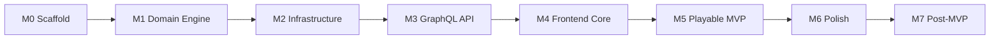

# 6-Nimmt — Implementation Roadmap

Task tracker for moving from **dev scaffold → playable MVP → portfolio polish**. Architecture and rules live in the other `.cursor/` docs — this file is the execution order.

**Last reviewed:** 2026-05-23

---

## Current State

| Area | Status | Notes |
|---|---|---|
| Documentation | ✅ Complete | `.cursor/` covers architecture, game rules, GraphQL, Redis, auth, DB, deployment, frontend design |
| Docker Compose | ✅ Complete | Postgres 16, Redis 7, backend, frontend |
| Backend scaffold | 🟡 Partial | FastAPI + Strawberry; only `health` query |
| Frontend scaffold | 🟡 Partial | Vue 3 + Vite + Tailwind v4 + URQL client stub; placeholder `App.vue` |
| Domain game engine | ⬜ Not started | `backend/app/domain/` does not exist |
| Redis live state | ⬜ Not started | No Redis client wiring |
| Guest auth | ⬜ Not started | No `ensureGuestSession` |
| GraphQL API (full) | ⬜ Not started | No mutations, subscriptions, or room types |
| PostgreSQL persistence | ⬜ Not started | SQLModel + Alembic declared but unused |
| Frontend screens | ⬜ Not started | No router, views, or game components |
| E2E playable demo | ⬜ Not started | Two-browser full game not possible yet |

**Commits so far:** docs initial commit → scaffold (backend, frontend, Docker).

---

## Milestone Overview



| Milestone | Goal | Unblocks |
|---|---|---|
| **M0** Scaffold | Runnable stack, docs | Everything |
| **M1** Domain engine | Pure rules + unit tests | Backend game logic |
| **M2** Infrastructure | Redis + auth + room state | Live multiplayer |
| **M3** GraphQL API | Queries, mutations, subscriptions | Frontend integration |
| **M4** Frontend core | Router, session, lobby, game UI shell | Visual demo |
| **M5** Playable MVP | Two browsers, full game loop | Portfolio demo |
| **M6** Polish | Design fidelity, motion, a11y, SFX | Showcase quality |
| **M7** Post-MVP | Match history, stats, prod profile | Optional extras |

---

## M0 — Scaffold ✅

- [x] Monorepo layout (`backend/`, `frontend/`, `docker-compose.yml`)
- [x] Backend: FastAPI entry, CORS, config via pydantic-settings
- [x] Backend: Strawberry GraphQL with `health` query
- [x] Frontend: Vue 3 + TypeScript + Vite + Tailwind CSS v4
- [x] Frontend: URQL + graphql-ws client stub (`src/graphql/client.ts`)
- [x] Docker Compose: Postgres, Redis, backend, frontend
- [x] `.env.example` files for backend and frontend
- [x] AI context docs in `.cursor/`

---

## M1 — Domain Game Engine

Pure Python module — **no I/O, no FastAPI imports**. Reference: [game-logic.md](./game-logic.md).

### 1.1 Card & deck primitives

- [ ] `backend/app/domain/cards.py` — `Card`, `Deck`, `bull_heads(value) -> int`
- [ ] Unit tests: bull heads for all rule branches (55, ×11, ×10, ×5, default)

### 1.2 Rows & placement helpers

- [ ] `backend/app/domain/rows.py` — `Row`, `find_best_row`, `pick_least_penalty_row` (Rule C v1 auto-pick)
- [ ] Unit tests: normal placement (Rule A), full row collection (Rule B), too-low auto-pick (Rule C + tie-break)

### 1.3 Game state & phases

- [ ] `backend/app/domain/game.py` — `GamePhase` enum, `GameState`, deal logic (player count → cards/rounds table)
- [ ] Seed four rows with one card each at game start
- [ ] `backend/app/domain/scoring.py` — penalty totals, winner resolution (ties = shared victory)

### 1.4 Turn resolution

- [ ] `backend/app/domain/resolve.py` — `resolve_turn(state, submissions) -> GameState`
- [ ] Submission barrier logic (conceptual — wired in M2): all active players must submit before resolve
- [ ] Unit tests: full 2-player mini-game (2 rounds); barrier does not resolve until complete

### 1.5 Test suite baseline

- [ ] `pytest` passes with `asyncio_mode = auto` (domain tests are sync)
- [ ] Ruff lint clean on `backend/app/domain/`

**M1 done when:** All game-logic test requirements pass with zero Redis/GraphQL dependencies.

---

## M2 — Infrastructure Layer

Reference: [state-management.md](./state-management.md), [auth.md](./auth.md), [database-schema.md](./database-schema.md).

### 2.1 Redis client & key helpers

- [ ] `backend/app/infrastructure/redis.py` — async Redis connection from `REDIS_URL`
- [ ] Key helpers: `guest:session:{id}`, `room:{id}`, `room:code:{code}`, pub/sub channel
- [ ] JSON serialize/deserialize for `GameRoomState` (Pydantic model)

### 2.2 Guest session service

- [ ] Mint `guestId` (UUID) + opaque `sessionToken`; store SHA-256 hash in Redis
- [ ] Session TTL: 7 days sliding; `touch` on authenticated request
- [ ] `ensureGuestSession` logic (create or return existing valid session)

### 2.3 Auth middleware / context

- [ ] `get_current_guest()` — extract Bearer token + optional `X-Guest-Id`, validate, fail closed
- [ ] GraphQL context injection with `GuestContext`

### 2.4 Room lifecycle (Redis)

- [ ] Generate 6-char join codes; `room:code:{code}` → `roomId` index
- [ ] `createRoom` — LOBBY state, host seat, max players default 10
- [ ] `joinRoom` — validate LOBBY, not full, reject mid-game joins
- [ ] `leaveRoom` — LOBBY removal vs mid-game `isConnected = false`
- [ ] Host transfer when host leaves in LOBBY
- [ ] TTL: 24h on room keys; 2h stale LOBBY cleanup (lazy or background)

### 2.5 Live game orchestration

- [ ] `startGame` — shuffle, deal, seed rows, transition LOBBY → DEAL → SUBMIT
- [ ] `submitCard` — validate phase/hand; atomic submission write (WATCH/MULTI or in-process lock)
- [ ] When all submitted → call `resolve_turn` → update state → publish
- [ ] Submission timeout (30s): auto-play lowest card for missing submissions
- [ ] Reconnect: match `guestId` to seat, set `isConnected = true`, 5s disconnect grace
- [ ] Monotonic `version` field on room state for client desync guard

### 2.6 Pub/sub fan-out hook

- [ ] `PUBLISH room:{roomId}` on every state change with minimal payload
- [ ] In-process subscriber bridge for GraphQL subscriptions (M3)

### 2.7 PostgreSQL (minimal — non-blocking)

- [ ] SQLModel models: `Guest`, `Room`, `Match`, `MatchPlayer`
- [ ] Alembic initial migration
- [ ] Async engine setup in `backend/app/infrastructure/db.py`
- [ ] On `FINISHED`: async persist match snapshot (failure must not block results UI)

**M2 done when:** Room create/join/start/submit/resolve works via direct Python integration tests against Redis (no GraphQL required yet).

---

## M3 — GraphQL API

Reference: [graphql-schema.md](./graphql-schema.md).

### 3.1 Schema types

- [ ] Enums: `GamePhase`, `GameErrorCode`
- [ ] Public types: `Card`, `Row`, `PlayerPublic`, `GameRoomPublic`, `SubmissionProgress`
- [ ] Private types: `PlayerPrivateView`, `ResolvedPlay`, `GuestSession`, `MutationResult`, `GameError`

### 3.2 Queries

- [ ] `health` (exists)
- [ ] `ensureGuestSession`
- [ ] `roomByCode(code)`
- [ ] `myGameView(roomId)` — player-specific view; **no hidden card leakage**

### 3.3 Mutations

- [ ] `createRoom`, `joinRoom`, `leaveRoom`, `startGame`, `submitCard`, `updateDisplayName`
- [ ] Typed error payloads (`success: false` + `GameErrorCode`); no exceptions for rule violations
- [ ] Return refreshed `view` on success

### 3.4 Subscriptions

- [ ] `gameRoomUpdated(roomId)` — public payload
- [ ] `myGameViewUpdated(roomId)` — **per-connection** private view (never broadcast shared private payload)
- [ ] WebSocket auth via `connectionParams.authorization`
- [ ] Subscribe to Redis pub/sub; rebuild view on `STATE_UPDATED`

### 3.5 Visibility & security audit

- [ ] Verify: other players' chosen cards never appear pre-resolve
- [ ] Verify: `myHand` only in `PlayerPrivateView`
- [ ] HTTP 401 for unauthenticated requests

### 3.6 API tests

- [ ] httpx async tests: session → create room → join → start → submit → finish
- [ ] Two-guest scenario: submission barrier + resolve

**M3 done when:** GraphQL playground can run a full 2-player game with subscriptions.

---

## M4 — Frontend Core

Reference: [frontend-patterns.md](./frontend-patterns.md), [frontend-design.md](./frontend-design.md), [frontend-stack.md](./frontend-stack.md).

### 4.1 Tooling & plumbing

- [ ] Vue Router — routes: `/`, `/room/:roomId/lobby`, `/room/:roomId/play`, `/room/:roomId/results`
- [ ] `@fontsource/inter` + dark theme CSS variables from frontend-design.md
- [ ] `lucide-vue-next` icons
- [ ] GraphQL operations files (`session`, `room`, `game`) — optional codegen
- [x] Fix URQL client: use `6nimmt_guest` localStorage key per auth.md (`src/lib/guest-session.ts`)

### 4.2 Composables

- [ ] `useGuestSession` — boot `ensureGuestSession`, persist session, attach auth headers
- [ ] `useGameRoom(roomId)` — `myGameViewUpdated` subscription as source of truth
- [ ] `useCardSelection` — select + submit with optimistic lock

### 4.3 Layout & feedback

- [ ] `AppShell.vue`, `MobileDesktopNotice.vue`, `SfxToggle.vue`
- [ ] `ToastHost.vue`, `ReconnectBanner.vue`, `ConfirmDialog.vue`
- [ ] `RulesDrawer.vue` — collapsible "How to play" + Rule C note

### 4.4 Home & lobby

- [ ] `HomeView` — name field, create room, 6-char code input with auto-advance
- [ ] `LobbyView` — player list, host badge, copy code/link, start game (host, ≥2 players)
- [ ] Phase-driven navigation: LOBBY → lobby route; SUBMIT+ → play route

### 4.5 Game shell (minimal first)

- [ ] `GameView` — subscribe to `myGameViewUpdated`
- [ ] `PhaseIndicator`, `SubmissionProgress`, `PlayerStrip`
- [ ] `GameBoard` + `GameRow` + `CardTile` (hue bands + bull-head indicators)
- [ ] `CardHand` — single-click submit, optimistic lock
- [ ] `GamePhaseOverlay` for DEAL / RESOLVE / SCORE
- [ ] `ResolveFeed` — stagger `lastResolvedPlays`
- [ ] `ResultsOverlay` on FINISHED

**M4 done when:** UI renders live state from backend subscriptions; host can start and players can submit cards.

---

## M5 — Playable MVP (Definition of Done)

Portfolio demo checklist from [deployment.md](./deployment.md):

- [ ] `docker compose up --build` starts full stack
- [ ] Two browser windows: create room → join with code → play full game to FINISHED
- [ ] Simultaneous submit barrier works (3+ players if tested)
- [ ] Disconnect/reconnect preserves seat and submission
- [ ] Rule C auto-pick surfaced in UI toast
- [ ] No hidden-card leaks (manual + automated check)
- [ ] Backend + frontend build without errors (`npm run build`, pytest)

**M5 done when:** A complete 2-player game finishes with correct scores and results overlay.

---

## M6 — Polish & Showcase Quality

Reference: [frontend-design.md](./frontend-design.md) motion catalog and accessibility checklist.

### 6.1 Visual fidelity

- [ ] Dark theme tokens applied consistently (not placeholder neutral-50 home page)
- [ ] Card gradients per value band; bull-head dot/ring indicators
- [ ] Felt surface behind board; amber accent on CTAs

### 6.2 Motion & feedback

- [ ] Hover lift, submit lock fade, progress pulse, resolve stagger, row highlight
- [ ] `prefers-reduced-motion` fallbacks for all animations
- [ ] Score count-up on results; winner gold border

### 6.3 Accessibility

- [ ] `aria-pressed` / `aria-disabled` on cards
- [ ] Toast `role="status"` / `role="alert"`
- [ ] Keyboard: Tab + number keys + Enter/Space submit
- [ ] WCAG AA contrast on card faces

### 6.4 Optional SFX

- [ ] Web Audio API triggers; `sfxEnabled` in localStorage; muted by default
- [ ] Assets in `frontend/public/sfx/`

### 6.5 Developer experience

- [ ] README quick-start verified on clean machine
- [ ] Match row visible in Postgres after game (`psql` spot-check)

---

## M7 — Post-MVP Backlog

Not required for portfolio demo. Track here; implement when M5–M6 are stable.

| Task | Doc reference |
|---|---|
| Match history query (`recentMatches`) | [database-schema.md](./database-schema.md) |
| Guest stats / leaderboard | [database-schema.md](./database-schema.md) |
| Manual Rule C row choice (timed UI) | [game-logic.md](./game-logic.md) |
| Spectator mode for finished games | [graphql-schema.md](./graphql-schema.md) |
| Rate limiting middleware | [auth.md](./auth.md) |
| `docker-compose.prod.yml` — nginx static frontend | [deployment.md](./deployment.md) |
| DataLoaders for history pages | [graphql-schema.md](./graphql-schema.md) |
| GraphQL codegen (`graphql-codegen`) | [frontend-patterns.md](./frontend-patterns.md) |
| CI: pytest + ruff + `vue-tsc` + build | — |
| Multi-worker Redis lock hardening | [state-management.md](./state-management.md) |

---

## Suggested Sprint Order

Work **vertically** in thin slices so something is testable every few tasks:

| Sprint | Focus | Deliverable |
|---|---|---|
| **S1** | M1 complete | `pytest` green on domain |
| **S2** | M2.1–2.4 | Guest session + room create/join in Redis |
| **S3** | M2.5–2.6 | Full game loop in Redis + pub/sub |
| **S4** | M3 | GraphQL API + subscription demo in playground |
| **S5** | M4.1–4.4 | Home + lobby wired to API |
| **S6** | M4.5 + M5 | Game view + two-browser MVP |
| **S7** | M6 | Design polish pass |
| **S8** | M2.7 + M7 picks | Postgres persistence + extras |

---

## Task Dependencies (Critical Path)

```
domain (M1)
  └─► redis room orchestration (M2)
        └─► graphql resolvers (M3)
              └─► frontend composables + views (M4)
                    └─► MVP demo (M5)
                          └─► polish (M6)
```

**Parallelizable after M1:**

- PostgreSQL models + Alembic (M2.7) — independent until `FINISHED` hook
- Frontend static components (CardTile, AppShell) — mock props before M3 lands

---

## How to Use This File

1. Pick the **first unchecked** task on the critical path (usually M1 → M2 → M3).
2. Read the linked doc section before coding.
3. Check boxes when merged; update **Current State** table at the top.
4. If architecture changes, update the relevant `.cursor/*.md` doc **before** checking off dependent tasks.

---

## Cross-References

| Need | Doc |
|---|---|
| System boundaries & data flow | [architecture-overview.md](./architecture-overview.md) |
| Game rules & edge cases | [game-logic.md](./game-logic.md) |
| API contract | [graphql-schema.md](./graphql-schema.md) |
| Redis keys & pub/sub | [state-management.md](./state-management.md) |
| Guest tokens | [auth.md](./auth.md) |
| Postgres tables | [database-schema.md](./database-schema.md) |
| Local run & demo | [deployment.md](./deployment.md) |
| UI screens & motion | [frontend-design.md](./frontend-design.md) |
| Vue conventions | [frontend-patterns.md](./frontend-patterns.md) |
| Doc index | [README.md](./README.md) |
