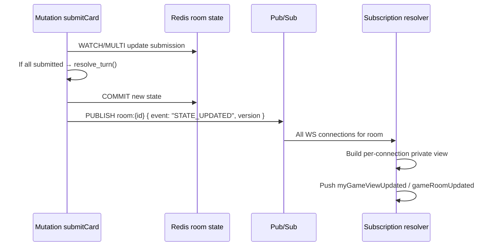
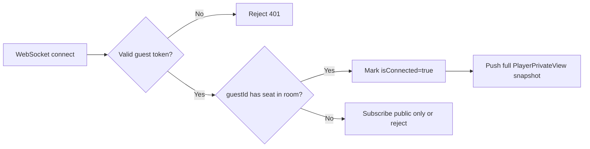

# State Management (Redis)

## Overview

**Redis** holds all **live** game data: rooms, seats, hands, submissions, and pub/sub channels for GraphQL subscription fan-out. PostgreSQL is not on the hot path during active play.

## Design Choices

| Choice | Rationale |
|---|---|
| JSON document per room | Simple reads/writes for portfolio scope; entire room state ≤ few KB |
| Atomic updates via Lua or WATCH/MULTI | Prevent lost submissions on concurrent mutations |
| TTL on abandoned rooms | Auto-cleanup LOBBY rooms with no activity |
| Pub/sub per room | Decouple game engine from WebSocket layer |

## Key Namespace

```
guest:session:{guestId}          → JSON GuestSession
room:code:{code}                 → roomId (string)
room:{roomId}                    → JSON GameRoomState (full internal state)
room:{roomId}:submissions        → HASH playerId → cardId (SUBMIT phase only)
room:{roomId}:channel            → pub/sub channel name (same as room id)
```

### Optional indexes

```
rooms:active                     → SET of roomIds (debug/admin)
guest:{guestId}:current_room     → roomId (fast reconnect)
```

## `GameRoomState` (Internal — Redis JSON)

This structure includes **secrets** never sent verbatim to GraphQL public types.

```typescript
interface GameRoomState {
  id: string;
  code: string;
  phase: GamePhase;
  roundNumber: number;
  maxPlayers: number;
  hostPlayerId: string;
  createdAt: string;
  updatedAt: string;

  rows: Array<{ cards: Array<{ id: string; value: number }> }>;

  players: Array<{
    id: string;
    guestId: string;
    displayName: string;
    bonesTotal: number;
    hand: Array<{ id: string; value: number }>;  // SECRET per player
    isConnected: boolean;
    submission: { cardId: string } | null;       // SECRET until resolve
  }>;

  deck: Array<{ id: string; value: number }>;     // Remaining undelt cards
  lastResolution: ResolvedPlay[] | null;
  winnerIds: string[] | null;
}
```

Serialization: **orjson** or **JSON** with Pydantic `model_dump()`.

## Pub/Sub Flow



### Message payload (minimal)

```json
{
  "event": "STATE_UPDATED",
  "roomId": "uuid",
  "version": 42,
  "phase": "SUBMIT"
}
```

Subscribers re-read `room:{roomId}` on notification — payload stays small; state is loaded once per event.

## Concurrent Mutation Safety

### Submission write pattern

```python
async def record_submission(redis, room_id, player_id, card_id):
    # 1. Load room (optimistic)
    # 2. Validate in application layer
    # 3. Use Redis transaction:
    #    - Verify phase == SUBMIT
    #    - Verify player has not submitted
    #    - Set submission
    # 4. If all submitted → run resolve in same critical section
    # 5. Publish update
```

Prefer a **single asyncio Lock per roomId** in-process **plus** Redis transaction for multi-worker safety (portfolio: single uvicorn worker is acceptable; document lock either way).

## TTL & Cleanup

| Key | TTL | Condition |
|---|---|---|
| `room:{roomId}` | 24h | Reset on each state change |
| `room:code:{code}` | Same as room | Deleted when room deleted |
| `guest:session:{guestId}` | 7 days | Sliding on activity |

**LOBBY cleanup:** If `updatedAt` stale > 2 hours and phase == LOBBY, cron task or lazy delete on join attempt.

## Connection & Reconnect



On disconnect:

- Set `isConnected = false` after grace period (5s) to avoid flap on refresh
- **Do not** remove seat during active game
- Submissions already stored remain valid

## Submission Timeout (Background Task)

During `SUBMIT` phase:

- Schedule deadline: `submit_deadline = now + 30s`
- Store `submitDeadline` in room state (optional field)
- On deadline: for each active player without submission → auto-play lowest card
- Then run `resolve_turn()`

Implement with **asyncio.create_task** per room or a single scheduler scanning Redis (portfolio: per-room task is fine).

## Desync Prevention

| Risk | Mitigation |
|---|---|
| Client shows stale hand | Subscription replaces local state; mutation returns fresh `view` |
| Double submit | Server rejects second submission |
| Partial resolve on crash | Use MULTI/EXEC; on failure, room stays in SUBMIT with logged error |
| Version drift | Include monotonic `version` in state; client ignores older subscription payloads |

## What NOT to Store in Redis

- Completed match archives (→ PostgreSQL)
- Large replay logs (post-MVP)

## Cross-References

- Domain algorithm: [game-logic.md](./game-logic.md)
- GraphQL types: [graphql-schema.md](./graphql-schema.md)
- Guest sessions: [auth.md](./auth.md)
