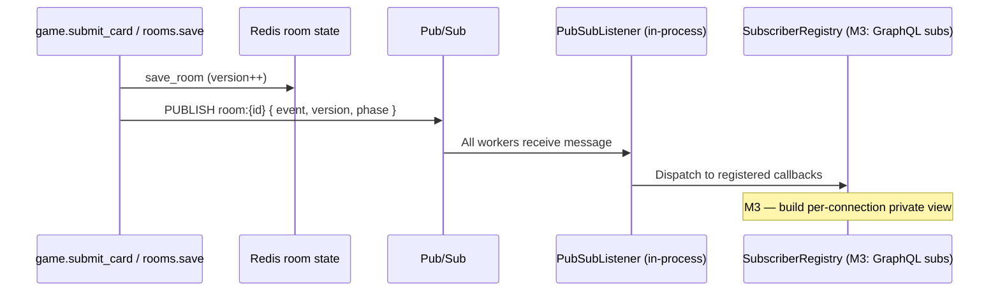
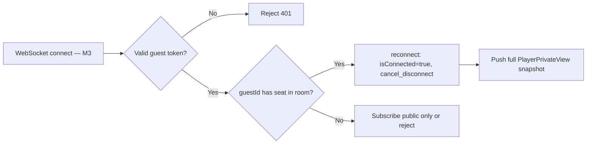

# State Management (Redis)

## Overview

**Redis** holds all **live** game data: rooms, seats, hands, submissions, and pub/sub channels for GraphQL subscription fan-out. PostgreSQL is not on the hot path during active play.

**Implementation status (M2+):** Sessions, rooms, game orchestration, pub/sub listener, and submit-timeout timers are implemented in `backend/app/infrastructure/`. Submissions live **inside** the room JSON document (not a separate Redis hash). GraphQL subscriptions and WS disconnect wiring are **M3+**.

## Design Choices

| Choice | Rationale |
|---|---|
| JSON document per room | Simple reads/writes for portfolio scope; entire room state ≤ few KB |
| Per-room `asyncio.Lock` (in-process) | Serializes mutations within one worker; see [Single-worker limitations](#single-worker-limitations-mvp) |
| TTL on abandoned rooms | Auto-cleanup LOBBY rooms with no activity |
| Pub/sub per room | Decouple game engine from WebSocket layer |

## Key Namespace

**As implemented (M2):**

```
guest:session:{guestId}          → JSON GuestSession
room:code:{code}                 → roomId (string)
room:{roomId}                    → JSON GameRoomState (includes submissions inline)
room:{roomId}                    → pub/sub channel (PUBLISH target; same id)
guest:{guestId}:current_room     → roomId (set on join/create)
```

**Not used in M2** (earlier design sketch — do not implement unless refactoring):

```
room:{roomId}:submissions        → separate HASH — superseded by inline player.submission
rooms:active                     → debug SET — not implemented
```

## `GameRoomState` (Internal — Redis JSON)

This structure includes **secrets** never sent verbatim to GraphQL public types. Implemented as Pydantic models in `backend/app/infrastructure/models.py`.

```typescript
interface GameRoomState {
  id: string;
  code: string;
  phase: GamePhase;
  roundNumber: number;
  maxPlayers: number;
  hostPlayerId: string;
  version: number;              // Monotonic; bumped on every save (not checked on read — see gaps)
  createdAt: string;
  updatedAt: string;
  submitDeadline: string | null;   // Set during SUBMIT; cleared otherwise
  submitTimeoutSeconds: number;    // 3–60; default 30; host sets in LOBBY

  rows: Array<{ cards: Array<{ id: string; value: number }> }>;

  players: Array<{
    id: string;
    guestId: string;
    displayName: string;
    bonesTotal: number;
    hand: Array<{ id: string; value: number }>;  // SECRET per player
    isConnected: boolean;                         // Infra flag; see is_connected vs is_active
    submission: string | null;                   // cardId; SECRET until resolve
  }>;

  deck: Array<{ id: string; value: number }>;
  lastResolution: ResolvedPlay[] | null;
  winnerIds: string[] | null;
}
```

**Turn timer:** `submitTimeoutSeconds` is stored on the room document. The host updates it in `LOBBY` via `updateSubmitTimeout`. Each `SUBMIT` phase schedules `submitDeadline = now + submitTimeoutSeconds`. The global `SUBMIT_TIMEOUT_SECONDS` env default in `config.py` is legacy; runtime deadlines use the per-room value.

Serialization: standard `json` via Pydantic `model_dump(mode="json")` in `redis.py`.

## Pub/Sub Flow

**As implemented:** `pubsub.publish_state_update()` publishes a minimal JSON payload after every room save. `PubSubListener` uses `psubscribe("room:*")` and dispatches to an in-process `SubscriberRegistry`. GraphQL subscription resolvers will register callbacks in M3.



### Message payload (minimal)

```json
{
  "event": "STATE_UPDATED",
  "roomId": "uuid",
  "version": 42,
  "phase": "SUBMIT"
}
```

Subscribers re-read `room:{roomId}` on notification — payload stays small; state is loaded once per event.

## Concurrent Mutation Safety

### As implemented (M2)

```python
async def submit_card(...):
    async with room_lock(room_id):          # in-process asyncio.Lock
        room = await rooms.load_room(...)
        # validate, set player.submission
        if all_seated_players_submitted:
            await _resolve_round(room)
        await _save_and_publish(room)       # version += 1, PUBLISH
```

- **Single worker:** per-room lock + full document rewrite is sufficient.
- **`version`:** incremented on every `save_room`; clients may ignore stale subscription payloads, but the server does **not** reject writes with a mismatched version yet.
- **Multi-worker (M7):** add Redis WATCH/MULTI or distributed lock; timer tasks must run on the worker that owns the room or move to Redis-based scheduling.

### Target pattern (multi-worker — post-MVP)

```python
async def record_submission(redis, room_id, player_id, card_id):
    # 1. Load room (optimistic)
    # 2. Validate in application layer
    # 3. Use Redis transaction:
    #    - Verify phase == SUBMIT
    #    - Verify player has not submitted
    #    - Set submission
    # 4. If all submitted → run resolve in same critical section
    # 5. Publish update
```

## Single-worker limitations (MVP)

| Mechanism | Location | Limitation |
|---|---|---|
| `asyncio.Lock` per room | `locks.py` | Process-local; multiple uvicorn workers can race on the same room |
| Submit/disconnect timers | `timers.py` | In-memory tasks; won't fire on a worker that didn't schedule them |
| `SubscriberRegistry` | `pubsub.py` | Callbacks are in-process; Redis pub/sub reaches all nodes but handlers are local |

**Portfolio default:** run uvicorn with **one worker** until M7 hardening. Document in deployment if scaling horizontally.

## TTL & Cleanup

| Key | TTL | Condition |
|---|---|---|
| `room:{roomId}` | 24h | Reset on each state change |
| `room:code:{code}` | Same as room | Deleted when room deleted |
| `guest:session:{guestId}` | 7 days | Sliding on activity |

**LOBBY cleanup:** If `updatedAt` stale > 2 hours and phase == LOBBY, cron task or lazy delete on join attempt.

## Connection & Reconnect

**Infrastructure (M2):** `game.reconnect()` and `game.mark_disconnected()` update `isConnected` on the seated player. `timers.schedule_disconnect()` waits 5s then calls `mark_disconnected` — **tested but not wired to WebSocket lifecycle yet (M3).**



On disconnect (target — M3):

- WS `on_disconnect` → `schedule_disconnect(roomId, guestId)`
- After 5s grace → `mark_disconnected` sets `isConnected = false` (avoids flap on refresh)
- **Do not** remove seat during active game
- Submissions already stored remain valid; disconnected players still block the submit barrier until the room submit deadline auto-plays for them

### `is_connected` vs domain `is_active`

| Flag | Layer | Purpose |
|---|---|---|
| `is_connected` | Infrastructure (`PlayerInRoom`) | UI presence; set by reconnect/disconnect |
| `is_active` | Domain (`PlayerState`) | Included in submission barrier via `active_player_ids` |

**Current behavior:** `adapters.room_to_game_state()` always sets `is_active=True` for all seated players. Submit barrier in `game.submit_card` waits for **all seated players**, not just connected ones. Disconnected players are auto-played on submit timeout. Reconcile or document explicitly when building M3 views.

## Submission Timeout (Background Task)

During `SUBMIT` phase — **implemented in M2:**

- `submit_deadline` stored on room state; `timers.schedule_submit_deadline()` creates an asyncio task
- On deadline: `handle_submit_timeout()` auto-plays lowest card for each player without a submission, then resolves
- Cancelled/rescheduled when a new SUBMIT round begins

Per-room asyncio task is fine for single-worker MVP. Multi-worker requires Redis-based deadline scanning (M7).

## Desync Prevention

| Risk | Mitigation |
|---|---|
| Client shows stale hand | Subscription replaces local state; mutation returns fresh `view` |
| Double submit | Server rejects second submission |
| Partial resolve on crash | Use MULTI/EXEC; on failure, room stays in SUBMIT with logged error |
| Version drift | Include monotonic `version` in state; client ignores older subscription payloads; server-side version check deferred to M7 |

## What NOT to Store in Redis

- Completed match archives (→ PostgreSQL)
- Large replay logs (post-MVP)

## Cross-References

- Domain algorithm: [game-logic.md](./game-logic.md)
- GraphQL types: [graphql-schema.md](./graphql-schema.md)
- Guest sessions: [auth.md](./auth.md)
