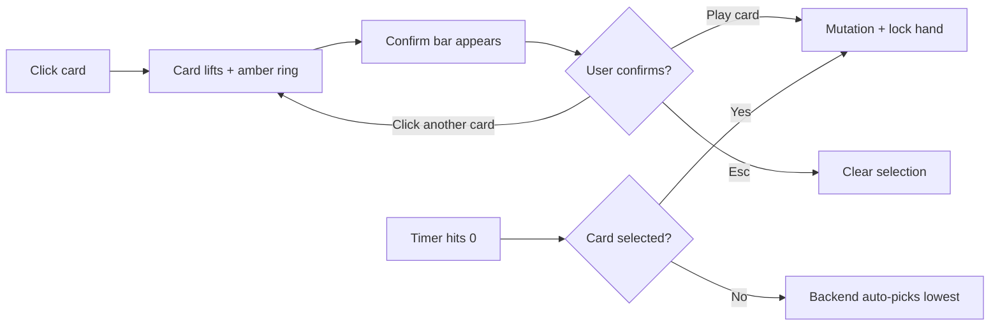

# UX Audit — Nielsen Heuristics

**Last reviewed:** 2026-05-23  
**Scope:** M4–M6 frontend (branch `cursor/m4-frontend-core`) vs. target UX for M5/M6  
**Related docs:** [frontend-design.md](./frontend-design.md), [frontend-patterns.md](./frontend-patterns.md), [graphql-schema.md](./graphql-schema.md), [roadmap.md](./roadmap.md)

This document is the **actionable UX backlog** derived from a Nielsen heuristic review. It records current gaps, target behavior, and implementation order. Update this file when items ship; keep [frontend-design.md](./frontend-design.md) aligned with locked-in decisions.

---

## Executive summary

M4 delivered a playable UI wired to GraphQL subscriptions; M6 ships the Nielsen heuristic backlog (Sprints A–C) plus post-game and lobby settings.

| Area | Documented | Shipped (M6+) |
|---|---|---|
| Turn timer | `SubmitCountdown.vue` planned | Circular countdown in `GameHudBar`; `submitDeadline` + configurable `submitTimeoutSeconds` (3–60s) |
| Card confirm flow | Single-click submit | Select → `CardConfirmBar` → submit, with 10s client timeout + retry |
| Submission status | `SubmissionProgress` bar | `PlayerStrip` border highlights (submitted / waiting / away / yours) |
| Loading states | Skeleton/spinner spec | `LoadingShell.vue` variants on Home, Lobby, Game |
| Error details | Toast with message | Expandable “More details” + optional Retry action |
| Keyboard shortcuts | `1`–`N`, Enter, Esc | Wired via `useGameShortcuts` (hand quick-select, confirm, Esc) |
| Rules help | Text bullets | Visual `RulesDrawer` with `CardTile` + mini `GameRow` examples |
| HUD layout | Stacked indicators | Compact `GameHudBar` (Round · Phase · Timer · Room · last resolve) |
| Post-game actions | Back to lobby / Leave | **Rematch** + **Exit room**; tie-aware results overlay |
| Lobby settings | — | Host turn-timer slider synced via `updateSubmitTimeout` |

**Status:** Sprint A, B, and C shipped. Remaining M6 items: full a11y audit, optional SFX, results score count-up animation.

---

## Heuristic 1 — Visibility of system status

### Current gaps

- **Submit in flight is invisible.** `useCardSelection` tracks `isSubmitting`, but `GameView` never surfaces it. If the mutation hangs, the hand locks with no feedback.
- **No turn timer.** Backend stores and schedules `submit_deadline` (see `backend/app/infrastructure/models.py`, `timers.py`), but GraphQL does not expose it — the client cannot render a countdown.
- **Loading is minimal.** Home, Lobby, and Game use text like “Loading game…” with no skeleton or spinner component.
- **Timeout auto-play is opaque.** When `handle_submit_timeout` auto-plays the lowest card, the affected player only learns after resolve — no live “Time’s up — playing card 23” moment.
- **Submission counter is redundant.** `SubmissionProgress` shows `3/4 submitted` while `PlayerStrip` already has per-player dots.

### Recommendations

| Priority | Action | Where |
|---|---|---|
| P0 | Expose `submitDeadline: DateTime` on `GameRoomPublic` | Backend GraphQL + `operations.ts` + `types.ts` |
| P0 | Build `SubmitCountdown.vue` — circular or bar timer; amber under 10s, red under 5s | New component in `GameView` |
| P0 | Show **“Submitting…”** on selected card + disable confirm while mutation pending; 10s client timeout with retry toast | `CardHand`, `GameView`, `useCardSelection` |
| P1 | Replace `SubmissionProgress` with **highlighted player cards** in `PlayerStrip` | See heuristic 6 |
| P1 | On timeout for self: brief overlay — *“Time’s up — playing your lowest card (47)”* before resolve | `GamePhaseOverlay` or toast + `ResolveFeed` |
| P2 | Shared `LoadingShell.vue` — skeleton board + hand placeholder | Home, Lobby, Game views |

### PlayerStrip highlight spec (replaces counter)

| State | Visual |
|---|---|
| Waiting to submit | Neutral border |
| Has submitted | Green left border + check icon |
| You (not submitted) | Amber pulse ring |
| Disconnected | Muted styling + “Away” label (not dot color alone) |

---

## Heuristic 2 — Match between the system and the real world

### Current gaps

- `SfxToggle` shows icon **and** “SFX on/off” text.
- Leave uses icon + “Leave” label in Lobby/Game.
- Copy actions use icon + text (acceptable — copy benefits from a label).

### Recommendations

| Control | Change | Accessibility |
|---|---|---|
| SFX | Icon-only toggle (`Volume2` / `VolumeX`) | `aria-label="Sound effects on/off"`, `aria-pressed` |
| Leave | Icon-only (`LogOut` or `ArrowLeft`) | `aria-label="Leave room"`, tooltip on hover |
| Copy code/link | Keep text **or** icon + tooltip | Copy is a low-recall action — labels help |

Icon-only secondary controls match the minimalist register while preserving screen-reader support via `aria-label`.

---

## Heuristic 3 — User control and freedom

### Current gap — critical UX mismatch

`CardHand` submits on first click (`@click="emit('submit', card.id)"`). `useCardSelection` already supports select-then-submit (`selectCard` + `submitSelectedCard`), but the UI bypasses it.

### Target flow



### Recommendations

1. `CardHand`: click → `select` (not `submit`).
2. Add a **confirm bar** below the hand: `CardTile` preview + **“Play card 47”** (primary) + **“Cancel”**.
3. Wire `Enter` → confirm, `Esc` → clear selection.
4. On deadline: if `selectedCardId` is set, call `submitSelectedCard()` before backend timeout (belt-and-suspenders; backend still auto-picks if the client misses it).

---

## Heuristic 4 — Consistency and standards

### Inconsistencies found

| Pattern | Issue |
|---|---|
| Leave confirm | `ConfirmDialog` confirm button is red (`bg-danger`); leave trigger is a muted text link |
| Errors | Mix of toasts, inline `subscriptionError`, and `submitError` — no unified error component |
| Primary actions | Amber CTAs on Home/Lobby; no confirm CTA in game hand |
| Icon buttons | Header SFX vs in-page Leave use different patterns |
| Phase labels | `PhaseIndicator` vs `GamePhaseOverlay` — both show phase info differently |

### Recommendations

1. Define **three button tiers** in docs: Primary (amber), Secondary (border), Destructive (red, dialogs only), Icon (ghost + tooltip).
2. Extract `IconButton.vue` — shared sizing, focus ring, tooltip, `aria-label`.
3. Unify errors through enhanced `ToastHost` (see heuristic 5).
4. Use the same Leave pattern in Lobby and Game (icon-only, same confirm dialog).

---

## Heuristic 5 — Error prevention

### Current gaps

- Toasts show only `message`; `GameError.code` is dropped on the client.
- No “More details” for expert users.
- No mutation timeout — user can sit in a locked state indefinitely.
- `ConfirmDialog` has no focus trap or keyboard defaults.

### Target toast shape

```typescript
interface ToastMessage {
  message: string        // Plain language for everyone
  variant: 'info' | 'error'
  details?: string       // code + technical context
  action?: { label: string; onClick: () => void }  // e.g. "Retry"
}
```

### Example copy

| Situation | Message | Details (collapsed) |
|---|---|---|
| Submit failed | “Couldn’t play your card. Check your connection and try again.” | `ALREADY_SUBMITTED · roomId=… · timestamp` |
| Session expired | “Your session expired. Refresh the page to continue.” | `SESSION_EXPIRED` |
| WS dropped mid-submit | “Connection lost while submitting. Retrying…” | `ws state: reconnecting` |

Also: disable confirm while `isSubmitting`; add client-side mutation timeout with auto-retry once.

---

## Heuristic 6 — Recognition rather than recall

### Current gaps

- `SubmissionProgress` forces users to interpret a fraction instead of scanning player cards.
- Rules are prose-only — players must recall card placement rules.
- No keyboard hint visible (“Press 1–6 to select, Enter to confirm”).
- Room code is prominent in lobby but easy to miss in-game.

### Recommendations

1. **Remove or demote** `SubmissionProgress`; drive status from `PlayerStrip` highlights (heuristic 1).
2. Keep room code visible in game HUD.
3. Add a **persistent hint strip** during SUBMIT: *“Select a card, then confirm · 1–6 quick select · Enter to play”*.
4. Enhance `RulesDrawer` with visual examples (heuristic 10).

---

## Heuristic 7 — Flexibility and efficiency of use

### Current gaps

- No global keyboard shortcuts.
- `ConfirmDialog` does not handle `Enter` / `Esc`.
- `useCardSelection.selectCardByIndex` exists but is never wired.

### Shortcut map

| Key | Context | Action |
|---|---|---|
| `Esc` | Game (SUBMIT) | Clear card selection |
| `Esc` | Game/Lobby | Open leave confirm |
| `Enter` | Confirm dialog | Confirm |
| `Esc` | Confirm dialog | Cancel |
| `1`–`9` | SUBMIT phase | Select nth card in hand |
| `Enter` | Card selected | Confirm play |
| `Enter` | Results overlay | Primary action (“Back to lobby”) |

Implement via `useGameShortcuts` composable (can use `@vueuse/core` `useMagicKeys`) scoped to `GameView`.

---

## Heuristic 8 — Aesthetic and minimalist design

### Current gaps

- HUD stacks `PhaseIndicator` + `SubmissionProgress` + `PlayerStrip` + `ResolveFeed` — visually busy.
- Submitted card appears twice (green banner + removed from hand).
- Text-heavy chrome (SFX label, Leave label, submission fraction).

### Recommendations

1. Collapse HUD to: **Round · Phase · Timer · Room code** in one compact bar.
2. Remove `SubmissionProgress` once `PlayerStrip` carries submission state.
3. Submitted card: show **only** in confirm area or player strip — not both banner and hand.
4. Icon-only secondary controls (SFX, Leave).
5. `ResolveFeed`: show only during/after RESOLVE; auto-collapse when next SUBMIT starts.

---

## Heuristic 9 — Help users recognize, diagnose, and recover from errors

### Current gaps

- Generic catch: `'Could not submit card'` — no next step.
- `subscriptionError` is raw text at page bottom — easy to miss.
- Reconnect banner appears only for WS, not failed mutations.
- No retry affordance.

### Error copy template

> **[What happened]** — [Why, in plain terms]. **[What to do next].**

Examples:

- *“Your card wasn’t registered — the server didn’t respond in time. Try playing it again.”* → Retry
- *“You already played this round — wait for other players.”* → no action
- *“Connection lost — reconnecting automatically.”* → existing banner

Promote `ReconnectBanner` to a general **`ConnectionStatusBanner`** that also covers slow mutations and refetch-after-reconnect.

---

## Heuristic 10 — Help and documentation

### Current state

`RulesDrawer` is three text paragraphs with a Rule C footnote — no visuals.

### Target — visual rules panel

Restructure into scannable sections with `CardTile` examples:

1. **Goal** — fewest bones wins (small score example).
2. **Rule A — Normal placement** — card 23 next to row ending in 19 → mini row visual.
3. **Rule B — Full row** — 5 cards + 6th triggers collection → static example.
4. **Rule C — Too low** — card 3 when all rows start higher → “auto-picks least bones row” with before/after rows.
5. **Turn flow** — select → confirm → wait for others (mirrors new UX).

Reuse `CardTile` and miniature `GameRow` inside the drawer so rules match in-game visuals exactly.

---

## Implementation order

Aligned with [roadmap.md](./roadmap.md) (M5 verification → M6 polish).

### Sprint A — Critical feedback (M5 blockers)

- [x] Expose `submitDeadline` in GraphQL + `SubmitCountdown.vue`
- [x] Select → confirm card flow + pending submit indicator
- [x] Auto-submit selected card on client deadline
- [x] `PlayerStrip` submission highlights; remove `SubmissionProgress`
- [x] Enhanced error toasts with “More details” + retry

### Sprint B — Efficiency & clarity (M6)

- [x] Keyboard shortcuts (`Esc`, `Enter`, `1`–`N`)
- [x] Icon-only SFX + Leave (`IconButton.vue`)
- [x] Unified `LoadingShell.vue`
- [x] Timeout auto-play feedback overlay
- [x] Visual `RulesDrawer` rewrite

### Sprint C — Consistency pass

- [x] Button tier system + shared components
- [x] Consolidate HUD layout (`GameHudBar.vue`)
- [x] Reconcile [frontend-design.md](./frontend-design.md) with shipped behavior

### Post-Sprint — End game & lobby settings

- [x] Tie-aware `ResultsOverlay` (shared rank, trophy rows, “Shared victory”)
- [x] `returnToLobby` mutation + Rematch / Exit room actions
- [x] Host-configurable `submitTimeoutSeconds` (3–60s) in `LobbyView`

---

## Frontend-only vs backend work

| Item | Frontend only | Needs backend |
|---|---|---|
| Select → confirm | ✅ | — |
| Submit pending indicator | ✅ | — |
| PlayerStrip highlights | ✅ | — |
| Icon-only buttons | ✅ | — |
| Keyboard shortcuts | ✅ | — |
| Error “More details” | ✅ | — |
| Visual rules drawer | ✅ | — |
| Turn countdown timer | — | ✅ `submitDeadline` + `submitTimeoutSeconds` on `GameRoomPublic` |
| Lobby turn timer UI | ✅ | ✅ `updateSubmitTimeout` + host slider |
| Post-game rematch | ✅ | ✅ `returnToLobby` + overlay actions |
| Timeout auto-play message | Partial | ✅ Brief overlay in `GameView`; optional: `autoSubmitted` on `ResolvedPlay` |

---

## Cross-references

| Need | Doc |
|---|---|
| Screen wireframes & motion | [frontend-design.md](./frontend-design.md) |
| Composables & submit flow | [frontend-patterns.md](./frontend-patterns.md) |
| API field to add | [graphql-schema.md](./graphql-schema.md) |
| Redis deadline source | [state-management.md](./state-management.md) |
| Milestone checklist | [roadmap.md](./roadmap.md) M6 |
